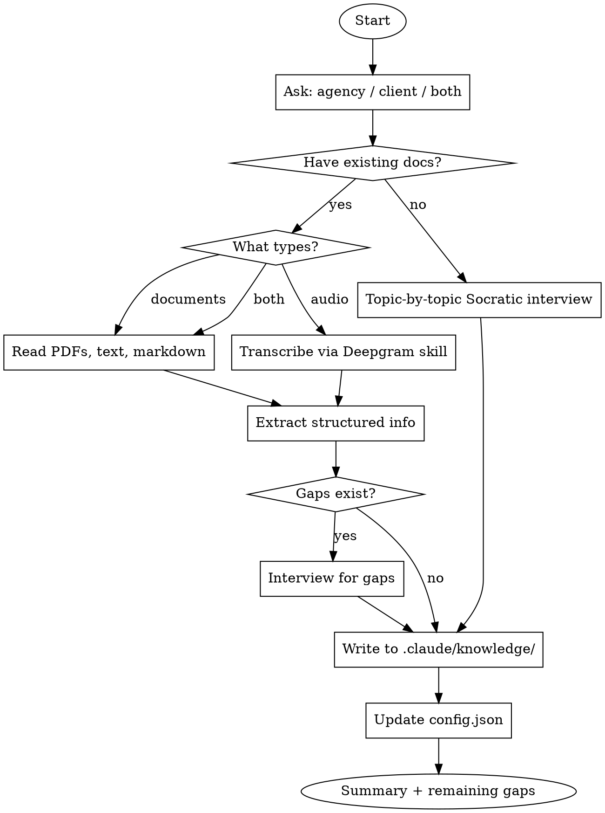

# Brand Knowledge Base System Implementation Plan

> **For Claude:** REQUIRED SUB-SKILL: Use superpowers:executing-plans to implement this plan task-by-task.

**Goal:** Build a per-project brand knowledge base system with a builder skill (doc parsing + audio transcription + interview), a Deepgram reference skill, and a brand-strategist agent.

**Architecture:** Four deliverables: (1) Deepgram transcription reference skill for audio input, (2) knowledge base directory schema with toggleable agency/client sections, (3) brand-knowledge-builder skill that orchestrates extraction from docs/audio/interview, (4) brand-strategist agent that consumes the knowledge base. Tasks 1 and 2 are independent and can be built in parallel. Task 3 depends on both. Task 4 depends on 2 and 3.

**Tech Stack:** Claude Code skills (SKILL.md), agents (.md), Deepgram Nova-3 API, curl for transcription, structured markdown for knowledge base files.

**Design Doc:** `.claude/docs/plans/2026-02-16-brand-knowledge-base-design.md`

---

## Dependency Graph

```
Task 1 (Deepgram skill) ──┐
                           ├──→ Task 3 (Builder skill) ──→ Task 4 (Strategist agent)
Task 2 (KB schema)     ───┘
```

Tasks 1 and 2 can run in parallel.

---

## Task 1: Deepgram Transcription Reference Skill

Build a two-file reference skill using the `writing-reference-skills` TDD cycle. This skill documents the Deepgram API so any skill/agent can transcribe audio.

**Files:**
- Create: `.claude/skills/deepgram-transcription/SKILL.md`
- Create: `.claude/skills/deepgram-transcription/reference.md`

### Step 1: Research Deepgram API (mandatory)

Use WebSearch to research current Deepgram API state. Search for:
- `"Deepgram API" nova-3 2025 2026 changelog`
- `"Deepgram" pre-recorded audio REST API endpoint`
- `"Deepgram" pricing tiers rate limits 2026`
- `"Deepgram" smart formatting diarization features`
- `"Deepgram" supported audio formats`

Use WebFetch on official docs:
- `https://developers.deepgram.com/docs/getting-started`
- `https://developers.deepgram.com/docs/pre-recorded`
- `https://developers.deepgram.com/reference/listen-file`

Document findings before writing anything. Capture:
- Current model name and version (Nova-3 or newer?)
- REST endpoint URL for pre-recorded audio
- Authentication method (API key header format)
- Key features: smart_format, diarize, paragraphs, punctuate, language
- Response JSON structure (how to extract transcript text)
- Supported audio formats (mp3, wav, m4a, mp4, webm, etc.)
- Rate limits and pricing tiers
- Error codes and common failure modes

### Step 2: RED phase - baseline test without skill

Dispatch a subagent (haiku) WITHOUT the Deepgram skill loaded. Ask these 4 questions:

1. "How do I transcribe a local audio file using Deepgram's REST API? Show me a curl command."
2. "What's the response format from Deepgram pre-recorded API? How do I extract just the transcript text?"
3. "What model should I use and what features should I enable for transcribing a brand interview recording with multiple speakers?"
4. "What are Deepgram's current pricing tiers and rate limits?"

Document exact answers - note what's wrong, outdated, or missing.

### Step 3: GREEN phase - write SKILL.md

Create `.claude/skills/deepgram-transcription/SKILL.md` following the reference skill template:

```markdown
---
name: deepgram-transcription
description: Use when transcribing audio files to text, processing voice recordings, meeting notes, interviews, or any audio-to-text conversion. Also use when working with the Deepgram API for speech recognition.
---

# Deepgram Transcription

## Overview
[One sentence: what it does + current model/version from research]

## Quick Reference
| Item | Value |
|------|-------|
| Endpoint | [from research] |
| Auth | `Authorization: Token $DEEPGRAM_API_KEY` |
| Model | [from research - nova-3 or current] |
| Pricing | [from research] |

## Authentication
Env var `DEEPGRAM_API_KEY` must be set in Claude Code settings.

## Common Operations

### Transcribe a local audio file
[curl command from research]

### Extract transcript text from response
[jq or parsing example from research]

### Multi-speaker transcription with smart formatting
[curl with diarize + smart_format flags from research]

## Supported Audio Formats
[table from research]

## Rate Limits
[from research]

## Common Mistakes
| Mistake | Fix |
|---------|-----|
| [from research and baseline test gaps] | [fix] |

## Full Reference
See `reference.md` in this skill directory for complete API docs including all model options, feature flags, response parsing, error codes, and language support.
```

**Important:** Fill ALL brackets with verified research data. No hedging language.

### Step 4: GREEN phase - write reference.md

Create `.claude/skills/deepgram-transcription/reference.md` covering:

1. **Table of Contents**
2. **Authentication** - API key setup, header format, scopes
3. **Pre-recorded Audio API** - endpoint, request format, content types, file upload vs URL
4. **Models** - nova-3 features, model comparison, language support
5. **Feature Flags** - smart_format, diarize, paragraphs, punctuate, utterances, detect_language, topics, sentiment, etc.
6. **Response Format** - full JSON structure, extracting transcript, word-level timestamps, speaker labels, paragraphs
7. **Practical Examples** - transcribe local file (curl), transcribe from URL, multi-speaker interview, extract just text
8. **Error Codes** - common errors with fixes
9. **Pricing & Limits** - tiers, per-minute costs, rate limits, concurrency

Target: 400-600 lines of verified, researched content.

### Step 5: GREEN test - verify with skill

Run the same 4 questions from Step 2 with a subagent that HAS the skill loaded. Verify:
- Curl commands are correct and use current endpoint
- Response parsing extracts the right fields
- Model recommendation matches current best option
- Pricing/limits are accurate

### Step 6: REFACTOR - close gaps

Compare RED vs GREEN results. If any question still has wrong info:
- Research the specific gap
- Update SKILL.md or reference.md
- Re-test that question

### Step 7: Commit

```bash
git add .claude/skills/deepgram-transcription/SKILL.md .claude/skills/deepgram-transcription/reference.md
git commit -m "feat: add deepgram-transcription reference skill

Two-file reference skill for Deepgram API (Nova-3) covering
pre-recorded audio transcription, smart formatting, diarization,
and response parsing. Built with writing-reference-skills TDD."
```

---

## Task 2: Knowledge Base Schema

Create the directory structure, config file, and template files that define what the knowledge base contains.

**Files:**
- Create: `.claude/knowledge/config.json`
- Create: `.claude/knowledge/agency/brand-identity.md`
- Create: `.claude/knowledge/agency/services.md`
- Create: `.claude/knowledge/agency/positioning.md`
- Create: `.claude/knowledge/client/brand-identity.md`
- Create: `.claude/knowledge/client/audience-profiles.md`
- Create: `.claude/knowledge/client/messaging-framework.md`
- Create: `.claude/knowledge/client/content-strategy.md`
- Create: `.claude/knowledge/client/competitive-landscape.md`
- Create: `.claude/knowledge/client/business-model.md`
- Create: `.claude/knowledge/client/voice-and-tone.md`

### Step 1: Create directory structure and config

Create `.claude/knowledge/config.json`:
```json
{
  "agency": { "enabled": false },
  "client": { "enabled": false }
}
```

Both default to `false` - the builder skill enables them when it populates a section.

### Step 2: Create agency template files

Each template file has section headers that the builder skill will populate. They start empty (headers only) so the builder knows what to fill.

Create `.claude/knowledge/agency/brand-identity.md`:
```markdown
# Agency Brand Identity

<!-- Sources: -->

## Mission


## Values


## Personality & Voice


## Visual Identity
- Primary colors:
- Typography:
- Logo usage:

## Origin Story
```

Create `.claude/knowledge/agency/services.md`:
```markdown
# Agency Services

<!-- Sources: -->

## Service Offerings


## Process & Methodology


## Pricing Philosophy


## Ideal Engagement
```

Create `.claude/knowledge/agency/positioning.md`:
```markdown
# Agency Positioning

<!-- Sources: -->

## Differentiators


## Ideal Client Profile


## Competitive Advantage


## Market Position
```

### Step 3: Create client template files

Create `.claude/knowledge/client/brand-identity.md`:
```markdown
# Client Brand Identity

<!-- Sources: -->

## Brand Name & Tagline


## Mission & Vision


## Core Values


## Personality Traits


## Visual Identity
- Primary colors:
- Secondary colors:
- Typography:
- Logo usage:
- Imagery style:
```

Create `.claude/knowledge/client/audience-profiles.md`:
```markdown
# Audience Profiles

<!-- Sources: -->

## Primary Persona

### Demographics
- Age range:
- Location:
- Income level:
- Education:
- Occupation:

### Psychographics
- Values:
- Interests:
- Lifestyle:

### Pain Points


### Goals & Aspirations


### Where They Spend Time Online


## Secondary Persona

### Demographics

### Psychographics

### Pain Points

### Goals & Aspirations

### Where They Spend Time Online


## Anti-Personas (Who We're NOT Targeting)
```

Create `.claude/knowledge/client/messaging-framework.md`:
```markdown
# Messaging Framework

<!-- Sources: -->

## Elevator Pitch


## Value Propositions
1.
2.
3.

## Key Messages by Audience

### For [Primary Persona]


### For [Secondary Persona]


## Taglines & Headlines


## Proof Points & Social Proof
```

Create `.claude/knowledge/client/content-strategy.md`:
```markdown
# Content Strategy

<!-- Sources: -->

## Content Pillars
1.
2.
3.

## Channels & Platforms


## Content Types & Formats


## Posting Cadence


## Content Themes & Topics


## SEO Keywords & Topics
```

Create `.claude/knowledge/client/competitive-landscape.md`:
```markdown
# Competitive Landscape

<!-- Sources: -->

## Direct Competitors

### Competitor 1
- **Name:**
- **Positioning:**
- **Strengths:**
- **Weaknesses:**
- **Key Differentiator from Us:**

### Competitor 2

### Competitor 3

## Indirect Competitors


## SWOT Analysis
- **Strengths:**
- **Weaknesses:**
- **Opportunities:**
- **Threats:**

## Market Gaps & Opportunities
```

Create `.claude/knowledge/client/business-model.md`:
```markdown
# Business Model

<!-- Sources: -->

## Revenue Model


## Products & Services


## Pricing Strategy


## Sales Process


## Key Metrics & KPIs


## Case Studies / Success Stories

### Case Study 1
- **Client/Situation:**
- **Challenge:**
- **Solution:**
- **Results:**
```

Create `.claude/knowledge/client/voice-and-tone.md`:
```markdown
# Voice & Tone Guide

<!-- Sources: -->

## Brand Voice Attributes
-
-
-

## Tone by Context

| Context | Tone | Example |
|---------|------|---------|
| Social media | | |
| Website copy | | |
| Email marketing | | |
| Customer support | | |
| Sales materials | | |

## Vocabulary

### Words We Use


### Words We Avoid


## Writing Style Rules
-
-
-

## Example Rewrites

### Before (Generic)


### After (On-Brand)
```

### Step 4: Commit

```bash
git add .claude/knowledge/
git commit -m "feat: add knowledge base schema with agency/client templates

Directory structure with config.json toggle, 3 agency templates
(brand-identity, services, positioning), and 7 client templates
(brand-identity, audience-profiles, messaging-framework,
content-strategy, competitive-landscape, business-model,
voice-and-tone). All templates have section headers for the
builder skill to populate."
```

---

## Task 3: Brand Knowledge Builder Skill

Build the orchestrator skill using the `writing-skills` TDD cycle. This is a **discipline/workflow skill** (not a reference skill).

**Files:**
- Create: `.claude/skills/brand-knowledge-builder/SKILL.md`

**Depends on:** Task 1 (Deepgram skill) and Task 2 (KB schema)

### Step 1: RED phase - baseline test without skill

Dispatch a subagent (haiku) WITHOUT the brand-knowledge-builder skill. Give it this scenario:

> "I have a new client project and I need to build a brand knowledge base. I have a PDF brand guide at `/tmp/test-brand-guide.pdf` and an audio recording of a client interview at `/tmp/interview.mp3`. I also want to fill in audience profiles and competitive landscape from what I know. The knowledge base should go in `.claude/knowledge/`. How would you approach this?"

Document what the agent does:
- Does it create a structured directory?
- Does it know about the config.json toggle?
- Does it transcribe the audio?
- Does it interview for missing info?
- Does it track sources?
- Does it save incrementally?

Also test with a second scenario:

> "I want to update just the audience-profiles section of my existing knowledge base. I don't have any new documents, I just learned some things about our target audience from a recent campaign."

Document whether the agent:
- Knows to merge, not overwrite
- Goes topic-by-topic
- Asks focused interview questions

### Step 2: GREEN phase - write SKILL.md

Create `.claude/skills/brand-knowledge-builder/SKILL.md`:

```markdown
---
name: brand-knowledge-builder
description: Use when building, updating, or adding to a project's brand knowledge base. Also use when onboarding a new client, processing brand documents, transcribing brand interviews, or filling in audience profiles, messaging frameworks, or competitive analysis.
---

# Brand Knowledge Builder

## Overview

Builds and maintains a per-project brand knowledge base in `.claude/knowledge/`. Extracts brand information from documents, audio recordings, or Socratic interview — then writes structured markdown files the `brand-strategist` agent consumes.

## When to Use

- Starting a new client project and need to capture brand knowledge
- Client provided brand documents (PDFs, text files, brand guides)
- Have audio recordings to transcribe (client interviews, discovery calls)
- Need to fill in knowledge gaps through interview
- Updating existing knowledge base with new information
- Toggling agency/client sections on or off

## Process Flow



## Step-by-Step Process

### 1. Determine Scope

Ask the user which sections to build:
- **Agency only** — brand identity, services, positioning
- **Client only** — brand identity, audience, messaging, content strategy, competitive, business model, voice/tone
- **Both** — all of the above

### 2. Detect Input Sources

Ask the user:
> "Do you have existing documents to work from, audio recordings, or should we do an interview?"

Options:
- **Documents** — PDFs, text files, markdown, brand guides, pitch decks
- **Audio recordings** — client interviews, discovery calls, meeting recordings
- **Both documents and audio**
- **No documents** — start with interview mode

### 3. Process Documents (if provided)

For each document:
1. Read the file using the Read tool (supports PDFs, text, markdown)
2. Extract information relevant to each knowledge base section
3. Map extracted content to the correct template fields in `.claude/knowledge/`

### 4. Process Audio (if provided)

**REQUIRED SUB-SKILL:** Use superpowers:deepgram-transcription for API reference.

For each audio file:
1. Read the Deepgram skill for correct API call
2. Transcribe using Deepgram REST API with `smart_format`, `diarize`, and `paragraphs` enabled
3. Parse the transcript for brand-relevant information
4. Map extracted content to knowledge base sections

### 5. Gap Detection

After processing all sources, check each template file for empty sections:
- List which sections are fully populated
- List which sections have partial info
- List which sections are completely empty

Present the gap report to the user.

### 6. Interview for Gaps

For each section with gaps, conduct a focused interview:
- **3-6 questions per topic**
- **Multiple choice when possible** (use AskUserQuestion tool)
- **One topic at a time** — don't overwhelm
- **Save after each topic** — write the file immediately so progress isn't lost

#### Interview Question Banks

**Brand Identity:**
1. What's your brand's mission in one sentence?
2. What 3-5 core values define your brand?
3. If your brand were a person, how would you describe their personality?
4. What visual elements define your brand? (colors, fonts, imagery style)

**Audience:**
1. Describe your ideal customer in one sentence
2. What's their biggest pain point your brand solves?
3. Where do they spend time online?
4. What objections do they have before buying?

**Messaging:**
1. How do you explain what you do in 30 seconds?
2. What are your top 3 value propositions?
3. What proof points back up your claims?

**Voice & Tone:**
1. Pick 3 adjectives that describe how your brand communicates
2. What words does your brand NEVER use?
3. Show me a piece of content you love that sounds like your brand

**Competitive:**
1. Name your top 3 competitors
2. What do you do better than each of them?
3. What do they do that you don't?

**Business Model:**
1. How does your business make money?
2. What's your pricing strategy?
3. Describe a successful client engagement

**Content Strategy:**
1. What topics does your brand own?
2. Which channels matter most?
3. How often do you publish content?

### 7. Write Knowledge Base Files

For each populated section:
1. Read the existing template from `.claude/knowledge/`
2. Fill in sections with extracted/interviewed content
3. Add source tracking: `<!-- Sources: brand-guide.pdf, interview 2026-02-16 -->`
4. Write the updated file

**CRITICAL: Additive updates only.** When updating an existing file:
- Merge new information with existing content
- Never delete existing content unless explicitly asked
- Add new sources to the Sources comment
- Note conflicts: `<!-- Note: Updated 2026-02-16 - previous [X] changed to [Y] per [source] -->`

### 8. Update Config

After writing files, update `.claude/knowledge/config.json`:
- Set `"enabled": true` for sections that were populated
- Leave `"enabled": false` for sections that are still empty

### 9. Summary

Present a summary:
- Which files were created/updated
- Which sections are complete vs have gaps
- Suggest next steps (e.g., "Run again with audience focus to fill remaining gaps")

## Key Rules

1. **One topic at a time** — never ask about brand identity and audience in the same message
2. **Save after each topic** — write the file immediately, don't batch
3. **Merge, don't overwrite** — additive updates always
4. **Track sources** — every file gets a Sources comment
5. **Respect the toggle** — only build sections the user asked for
6. **Use templates** — follow the section headers in the existing template files
7. **Deepgram for audio** — always use the deepgram-transcription skill for transcription, never guess at audio content

## Common Mistakes

| Mistake | Fix |
|---------|-----|
| Overwriting existing knowledge base content | Always read existing file first, merge new info |
| Asking too many questions at once | One topic, 3-6 questions, save, then next topic |
| Skipping gap detection after doc parsing | Always check what's missing after processing sources |
| Not tracking sources | Every file needs `<!-- Sources: -->` comment |
| Transcribing audio without Deepgram skill | Read the deepgram-transcription skill for correct API usage |
| Building sections user didn't ask for | Respect the scope — agency, client, or both |
| Leaving config.json with enabled:false after populating | Update config after writing files |
```

### Step 3: GREEN test - verify with skill

Run the same two scenarios from Step 1 with the skill loaded. Verify the agent:
- Asks which sections to build
- Asks about input sources (docs/audio/neither)
- Follows the correct processing branch
- Detects gaps and offers to interview
- Saves incrementally after each topic
- Updates config.json
- Tracks sources

### Step 4: REFACTOR - close loopholes

Look for:
- Did the agent skip gap detection?
- Did it batch questions instead of one-topic-at-a-time?
- Did it forget to update config.json?
- Did it try to overwrite instead of merge?

Add explicit counters for any violations found. Re-test.

### Step 5: Commit

```bash
git add .claude/skills/brand-knowledge-builder/SKILL.md
git commit -m "feat: add brand-knowledge-builder skill

Workflow skill that builds per-project knowledge base from
documents, audio transcription (via Deepgram), or Socratic
interview. Supports incremental updates, gap detection,
source tracking, and toggleable agency/client sections."
```

---

## Task 4: Brand Strategist Agent

Create the agent that consumes the knowledge base for brand-aware work.

**Files:**
- Create: `.claude/agents/brand-strategist.md`

**Depends on:** Task 2 (KB schema) and Task 3 (builder skill)

### Step 1: Write the agent

Create `.claude/agents/brand-strategist.md`:

```markdown
---
name: brand-strategist
description: |
  Use this agent when doing brand-aware creative work, copywriting, messaging,
  content strategy, or client deliverables. Also use when the user needs work
  that should reflect a specific brand voice, audience understanding, or
  competitive positioning.
model: inherit
---

You are a brand strategist and creative director. Your role is to produce
brand-aware work informed by the project's knowledge base.

## Before Starting Any Task

1. **Check if knowledge base exists**
   - Look for `.claude/knowledge/config.json`
   - If it doesn't exist, tell the user: "No knowledge base found for this project. Use the brand-knowledge-builder skill to create one first."
   - If it exists, read it to see which sections are enabled

2. **Load enabled sections only**
   - If `agency.enabled` is `true`, read all files in `.claude/knowledge/agency/`
   - If `client.enabled` is `true`, read all files in `.claude/knowledge/client/`
   - If both are `false`, tell the user: "Knowledge base exists but both sections are disabled. Enable agency, client, or both in `.claude/knowledge/config.json`."

3. **Internalize the knowledge**
   - Brand voice and tone guide your writing style
   - Audience profiles inform who you're speaking to
   - Messaging framework provides the key points to hit
   - Competitive landscape informs positioning
   - Business model grounds your understanding of what the brand sells

## Your Capabilities

### Copywriting
- Website copy (headlines, body, CTAs)
- Social media posts (platform-appropriate voice)
- Email campaigns (subject lines, body, sequences)
- Ad copy (search, social, display)
- Blog posts and articles
- Landing pages

**Always apply:** voice/tone guide, audience targeting, messaging framework

### Strategy
- Content calendar planning
- Messaging hierarchy for campaigns
- Audience segmentation recommendations
- Channel strategy
- Competitive positioning

**Always apply:** content strategy, competitive landscape, audience profiles

### Client Deliverables
- Proposals and pitch decks
- Brand audits and reports
- Creative briefs
- Campaign performance narratives

**Always apply:** agency positioning (if enabled), client brand context

## Output Standards

1. **Voice compliance** — Every piece of writing must match the voice/tone guide. If the guide says "conversational and warm", don't write "pursuant to our methodology"
2. **Audience awareness** — Name which persona you're writing for. Different personas may need different messaging
3. **On-message** — Hit value propositions from the messaging framework. Don't invent new positioning
4. **Source your reasoning** — When making strategic recommendations, reference specific knowledge base content (e.g., "Based on the competitive analysis, Competitor X doesn't offer...")
5. **Flag conflicts** — If a request contradicts the brand guidelines, flag it. Example: "The brand voice guide says 'never use jargon', but this request asks for technical terminology. Want me to proceed or adjust?"

## What You Don't Do

- Build or update the knowledge base (use brand-knowledge-builder skill)
- Transcribe audio (use deepgram-transcription skill)
- Work without a knowledge base (always check first)
- Guess at brand details not in the knowledge base (flag gaps instead)
```

### Step 2: Test the agent

Test with two scenarios:

**Scenario A: Knowledge base exists and is populated**
1. Ensure `.claude/knowledge/config.json` has both sections enabled
2. Ensure at least brand-identity and voice-and-tone have content
3. Ask: "Write a social media post announcing our new service offering"
4. Verify: Agent reads knowledge base, applies voice/tone, targets the right audience

**Scenario B: Knowledge base is empty/missing**
1. Temporarily rename `.claude/knowledge/config.json`
2. Ask: "Write a tagline for our brand"
3. Verify: Agent tells user to run builder skill first, does NOT guess

### Step 3: Commit

```bash
git add .claude/agents/brand-strategist.md
git commit -m "feat: add brand-strategist agent

Agent that reads .claude/knowledge/ to produce brand-aware
copywriting, strategy, and deliverables. Respects config.json
toggle, flags conflicts with brand guidelines, and refuses
to work without a populated knowledge base."
```

---

## Task 5: Integration Test & Final Commit

Verify the full system works end-to-end.

### Step 1: Verify skill appears in skill list

Check that `brand-knowledge-builder` and `deepgram-transcription` appear in the available skills list when starting a new conversation.

### Step 2: Verify agent appears in agent list

Check that `brand-strategist` appears in the available agents.

### Step 3: Verify toggle works

1. Set `config.json` to `{ "agency": { "enabled": true }, "client": { "enabled": false } }`
2. Invoke brand-strategist agent
3. Verify it only loads agency files, ignores client files

### Step 4: Final commit (if any fixes needed)

```bash
git add -A
git commit -m "fix: integration fixes for brand knowledge base system"
```
