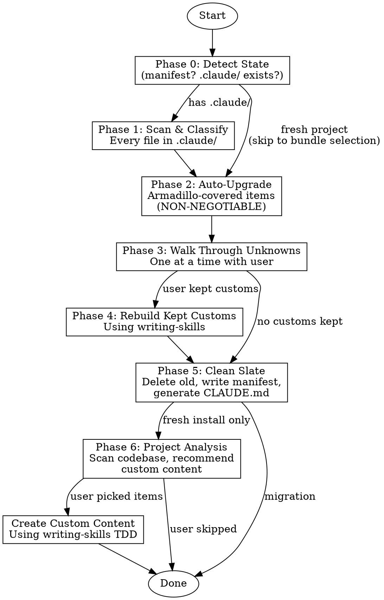

# Onboarding Project Analysis Phase — Implementation Plan

> **For Claude:** REQUIRED SUB-SKILL: Use armadillo:executing-plans to implement this plan task-by-task.

**Goal:** Add Phase 6 (Project Analysis & Custom Content Creation) to the onboarding skill so fresh installs scan the codebase and recommend project-specific custom skills/agents/docs.

**Architecture:** Phase 6 runs ONLY on fresh installs (no existing `.claude/`), after Phase 5 finishes the clean slate. It scans the project codebase, builds a profile, recommends custom content, lets user pick, then creates each item using `writing-skills` TDD. This reuses the existing Phase 4 pattern (writing-skills for rebuild) but applies it to brand-new content derived from codebase analysis.

**Tech Stack:** Markdown (skill documentation), shell (test prompts)

---

### Task 1: Update Process Flow Flowchart

**Files:**
- Modify: `.claude/skills/onboarding/SKILL.md:30-53` (flowchart)

**Step 1: Edit the flowchart**

Replace the existing flowchart with one that includes Phase 6. The key changes:
- Add `analyze` node for Phase 6
- Fresh install path: `detect → upgrade → clean → analyze → done`
- Migration path: `detect → scan → upgrade → walk → rebuild → clean → done` (no Phase 6)
- Phase 6 has a conditional: if user picks items → create them → done, else → done directly



**Step 2: Verify the edit**

Read back lines 30-54 of the file and confirm the new flowchart is valid graphviz with all nodes connected.

**Step 3: Commit**

```bash
git add .claude/skills/onboarding/SKILL.md
git commit -m "feat(onboarding): add Phase 6 to process flowchart"
```

---

### Task 2: Update Overview and Phase 0

**Files:**
- Modify: `.claude/skills/onboarding/SKILL.md:8-11` (Overview)
- Modify: `.claude/skills/onboarding/SKILL.md:56-67` (Phase 0)

**Step 1: Update Overview to mention project analysis**

Add a sentence about Phase 6 to the overview paragraph (line 10). The overview currently says:

> Intelligent project onboarding that sets up armadillo from scratch or migrates an existing `.claude/` setup to armadillo standard. Scans existing `.claude/` setups, auto-upgrades everything armadillo covers (non-negotiable), walks through custom unknowns with the user, rebuilds kept customs to armadillo quality, and leaves a clean slate with proper manifest tracking.

Change to:

> Intelligent project onboarding that sets up armadillo from scratch or migrates an existing `.claude/` setup to armadillo standard. For fresh installs, scans the entire project codebase and recommends custom skills, agents, and documentation tailored to the tech stack. For migrations, scans existing `.claude/` setups, auto-upgrades everything armadillo covers (non-negotiable), walks through custom unknowns with the user, and rebuilds kept customs to armadillo quality. Leaves a clean slate with proper manifest tracking.

**Step 2: Update Phase 0 fresh install path**

In Phase 0, step 5, the fresh install bullet currently says:
> - No `.claude/` → **Fresh install** (skip to Phase 2 bundle selection)

Change to:
> - No `.claude/` → **Fresh install** (skip to Phase 2 bundle selection, then Phase 6 project analysis)

**Step 3: Commit**

```bash
git add .claude/skills/onboarding/SKILL.md
git commit -m "feat(onboarding): update overview and Phase 0 for project analysis"
```

---

### Task 3: Write Phase 6 Section

**Files:**
- Modify: `.claude/skills/onboarding/SKILL.md` — insert Phase 6 between Phase 5 (ending at line ~394) and Key Rules (starting at line ~396)

This is the core task. Insert the entire Phase 6 section after Phase 5's `5e. Summary` subsection and before `## Key Rules`.

**Step 1: Write the Phase 6 content**

Insert the following between Phase 5e's closing code block and `## Key Rules`:

````markdown
## Phase 6: Project Analysis (Fresh Installs Only)

**When:** This phase runs ONLY on fresh installs (no existing `.claude/` directory). Migrations skip this — they already handle custom content in Phases 3-4.

**Why:** A fresh armadillo install gives you the standard toolkit, but every project is different. Phase 6 scans the codebase to understand the project and recommends custom content tailored to what's actually here.

### 6a. Codebase Scan

Use **Glob** and **Read** to scan the project (NOT `.claude/` — the actual project codebase).

**Skip these directories entirely:**
- `.git/`, `node_modules/`, `vendor/`, `dist/`, `build/`, `.next/`, `.nuxt/`, `.svelte-kit/`, `__pycache__/`, `.venv/`, `target/`, `coverage/`

**Detect and read these signals:**

| Signal | Files to Check |
|--------|---------------|
| **Language** | `package.json`, `Cargo.toml`, `go.mod`, `pyproject.toml`, `Gemfile`, `pom.xml`, `build.gradle` |
| **Framework** | `next.config.*`, `nuxt.config.*`, `astro.config.*`, `svelte.config.*`, `angular.json`, `remix.config.*`, `vite.config.*` |
| **Test framework** | `jest.config.*`, `vitest.config.*`, `pytest.ini`, `setup.cfg` `[tool.pytest]`, `.mocharc.*`, `playwright.config.*`, `cypress.config.*` |
| **CI/CD** | `.github/workflows/`, `.gitlab-ci.yml`, `Jenkinsfile`, `.circleci/`, `bitbucket-pipelines.yml` |
| **Deploy target** | `vercel.json`, `netlify.toml`, `fly.toml`, `Dockerfile`, `docker-compose.yml`, `railway.json`, `render.yaml`, `Procfile` |
| **Database** | Prisma schema, Drizzle config, Sequelize config, `.env` references to `DATABASE_URL` |
| **API style** | GraphQL schemas (`.graphql`), OpenAPI specs (`openapi.yaml`/`swagger.json`), tRPC routers |
| **Monorepo** | `pnpm-workspace.yaml`, `lerna.json`, `nx.json`, `turbo.json`, root `workspaces` in package.json |

**Read key files** (first 100 lines is sufficient for most):
- `README.md` — project description, setup instructions
- `package.json` — dependencies, scripts
- Main config file for detected framework
- CI config files
- Test config files

### 6b. Build Project Profile

Summarize findings into a structured profile:

```
## Project Profile

**Project:** [name from package.json/README or directory name]
**Language:** TypeScript (Node 20)
**Framework:** Next.js 14 (App Router)
**Package manager:** pnpm
**Test framework:** Vitest + Playwright (e2e)
**CI/CD:** GitHub Actions (lint → test → deploy)
**Deploy:** Vercel
**Database:** Postgres via Prisma
**API:** tRPC
**Monorepo:** No
**Key dependencies:** [top 5-10 notable deps]
```

Present this profile to the user: **"Here's what I found in your codebase. Does this look right? Anything I missed?"**

### 6c. Generate Recommendations

Based on the project profile, recommend custom content. Each recommendation must include:
- **Type:** skill, agent, or documentation
- **Name:** proposed name (kebab-case for skills/agents)
- **Why:** one sentence explaining why this project would benefit
- **What it covers:** 2-3 bullet points of scope

**Recommendation categories:**

**Project-specific skills** (how to do things in THIS project):
- Deploy workflow (if CI/CD detected)
- Test suite patterns (if test framework detected)
- Database migrations (if ORM detected)
- API patterns (if API style detected)
- Monorepo navigation (if monorepo detected)

**Custom agents** (specialized reviewers/workers):
- Framework-specific code reviewer (e.g., "Next.js App Router reviewer" that knows RSC rules)
- Test reviewer (knows the project's test patterns)

**Project documentation** (for `.claude/docs/`):
- Architecture overview (always recommended for non-trivial projects)
- API reference (if project has APIs)
- Environment setup guide (if complex setup detected)

**CLAUDE.md additions** (project-specific instructions):
- Build/test/lint commands (from `package.json` scripts or equivalent)
- Project conventions detected from codebase
- Environment variable requirements

### 6d. Present Recommendations

Use **AskUserQuestion** with `multiSelect: true` to let the user pick which recommendations to create:

```
## Recommended Custom Content

Based on your project profile, I recommend creating:

**Skills:**
☐ vercel-deploy — Deploy workflow for your Vercel + GitHub Actions setup
☐ prisma-migrations — Database migration patterns for your Prisma setup

**Agents:**
☐ nextjs-reviewer — Code reviewer that knows Next.js App Router patterns (RSC, server actions, etc.)

**Documentation:**
☐ architecture-overview — High-level architecture doc for .claude/docs/

**CLAUDE.md additions:**
☐ Project commands and conventions

Which would you like me to create? (Select all that apply, or skip to finish)
```

If user selects none or skips → proceed to Done.

### 6e. Create Approved Content

For each approved item, in order:

**For skills:**
1. **REQUIRED SUB-SKILL:** Use armadillo:writing-skills
2. Create the skill following full TDD process (baseline test → write skill → verify → refactor)
3. Write to `.claude/skills/<skill-name>/SKILL.md`
4. Add to manifest as `owner: "user"`
5. Add to CLAUDE.md skills list (in the project-specific section below armadillo markers)

**For agents:**
1. Create agent file at `.claude/agents/<agent-name>.md`
2. Include proper frontmatter (name, description, model)
3. Write clear system prompt based on codebase analysis
4. Add to manifest as `owner: "user"`

**For documentation:**
1. Write to `.claude/docs/<doc-name>.md`
2. Base content on actual codebase analysis (not generic templates)
3. Add to manifest as `owner: "user"`

**For CLAUDE.md additions:**
1. Add project-specific instructions below the `<!-- Add your project-specific instructions below this line -->` comment
2. Include actual commands from `package.json` scripts
3. Include conventions detected from codebase

**After each item:** Commit with descriptive message.

### 6f. Update Manifest

After all items are created, update the manifest:
- Add all new files to `files` with `owner: "user"` and computed SHA-256 hash
- Update `updatedAt` timestamp

**Checkpoint:** Update manifest with `phase: 6`.
````

**Step 2: Verify the edit**

Read back the Phase 6 section and confirm:
- It's placed between Phase 5e and Key Rules
- All markdown formatting is correct
- No orphaned references

**Step 3: Commit**

```bash
git add .claude/skills/onboarding/SKILL.md
git commit -m "feat(onboarding): add Phase 6 project analysis for fresh installs"
```

---

### Task 4: Update Phase 5e Summary and Key Rules

**Files:**
- Modify: `.claude/skills/onboarding/SKILL.md` — Phase 5e summary template, Key Rules, Common Mistakes

**Step 1: Update Phase 5e summary template**

In the summary template (around line 374-394), add Phase 6 results. After the existing **Next steps:** section, add a conditional block:

```
**Project analysis:** (fresh installs only)
- Scanned codebase: [language] / [framework] / [test framework]
- Created: [N] custom skills, [N] agents, [N] docs
- CLAUDE.md updated with project-specific instructions
```

Also update the **Next steps:** to mention Phase 6 outcomes:
```
**Next steps:**
- Start a Claude Code session to use your new skills
- Run brand-knowledge-builder to fill in knowledge base templates
- Use updating-armadillo skill when new versions are available
- Review generated custom content and refine as needed
```

**Step 2: Add Key Rule #9**

After rule 8, add:

```
9. **Phase 6 is fresh installs only** — migrations already handle custom content in Phases 3-4; don't double-scan
10. **Recommend, don't auto-create** — always present recommendations and let user choose; never create custom content without explicit approval
11. **Full writing-skills TDD for each item** — no shortcuts, no "quick drafts", every custom skill gets the full treatment
```

**Step 3: Add Common Mistakes rows**

Add to the Common Mistakes table:

```
| Running Phase 6 on migrations | Phase 6 is for fresh installs only — migrations use Phases 3-4 |
| Auto-creating custom content without asking | Always present recommendations via AskUserQuestion with multiSelect |
| Skipping writing-skills TDD for custom content | Every custom skill/agent gets full TDD process — no shortcuts |
| Recommending generic content that doesn't use codebase findings | Recommendations must reference specific things found in the scan |
| Scanning node_modules, .git, or other excluded dirs | Skip all directories listed in 6a's exclusion list |
```

**Step 4: Commit**

```bash
git add .claude/skills/onboarding/SKILL.md
git commit -m "feat(onboarding): update summary, rules, and mistakes for Phase 6"
```

---

### Task 5: Add Test Prompt

**Files:**
- Create: `.claude/tests/explicit-skill-requests/prompts/onboarding-fresh-with-scan.txt`
- Modify: `.claude/tests/skill-triggering/prompts/onboarding.txt` (if needed — check if it needs updating)

**Step 1: Create explicit skill request test prompt**

Write a test prompt that exercises the fresh install + project analysis path:

```
Set up armadillo in this project. No existing .claude/ directory. After installing, scan the codebase and recommend custom skills and documentation for this project.
```

**Step 2: Register test in skills.json**

Add the new test file to `sharedFiles.tests` in `skills.json`:

```json
"tests/explicit-skill-requests/prompts/onboarding-fresh-with-scan.txt"
```

Insert it alphabetically near the other onboarding test prompts.

**Step 3: Commit**

```bash
git add .claude/tests/explicit-skill-requests/prompts/onboarding-fresh-with-scan.txt skills.json
git commit -m "test(onboarding): add test prompt for fresh install with project scan"
```

---

### Task 6: Final Verification

**Step 1: Read the complete SKILL.md**

Read the entire `.claude/skills/onboarding/SKILL.md` file and verify:
- Phase 6 section is complete and well-formatted
- Flowchart correctly shows Phase 6 conditional path
- Overview mentions project analysis
- Phase 0 mentions Phase 6 for fresh installs
- Phase 5e summary includes Phase 6 results
- Key Rules include Phase 6 rules (rules 9-11)
- Common Mistakes include Phase 6 mistakes
- No broken markdown, no orphaned references

**Step 2: Run existing test suite**

```bash
cd "/Users/zachwieder/Documents/AGENCY/Zach Tools/armadillo-cli" && .claude/tests/explicit-skill-requests/run-all.sh
```

Verify all existing tests still pass (the new test prompt won't be runnable without a full Claude session, but existing ones should be unaffected).

**Step 3: Verify skills.json is valid JSON**

```bash
python3 -c "import json; json.load(open('skills.json')); print('Valid JSON')"
```

**Step 4: Final commit if any fixes needed**

```bash
git add -A
git commit -m "fix(onboarding): address verification findings"
```
