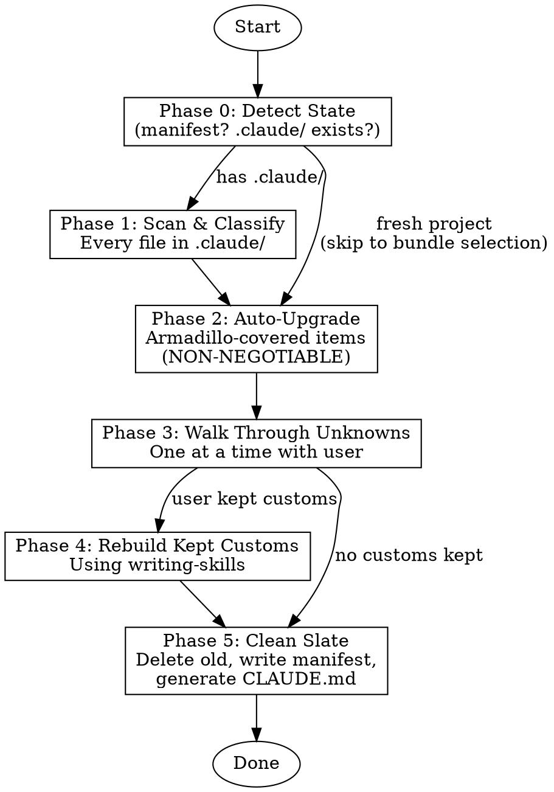
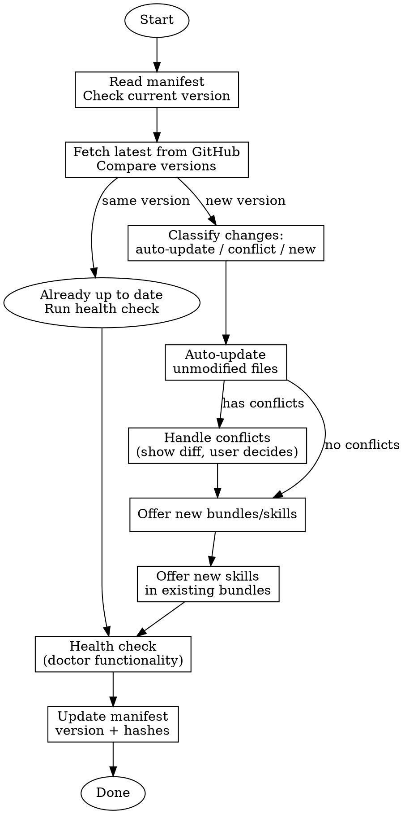

# Armadillo Onboarding & Update Skills — Implementation Plan

> **For Claude:** REQUIRED SUB-SKILL: Use armadillo:executing-plans to implement this plan task-by-task.

**Goal:** Replace CLI init/update/doctor intelligence with two skills (`onboarding` and `updating-armadillo`) that run inside Claude Code — scanning existing setups, auto-upgrading anything armadillo covers, walking through custom unknowns with the user, rebuilding kept customs to armadillo quality, and leaving a clean slate.

**Architecture:** Two skills with shared classification logic. The **onboarding skill** handles first-time setup AND migration from existing `.claude/` setups. The **updating-armadillo skill** pulls the latest from GitHub, compares to the user's install, and intelligently handles differences. Both use Opus 4.6 as the model for thinking-heavy classification work. The CLI shrinks to just a package manager (download/version files) — all intelligence lives in these skills.

**Tech Stack:** Markdown skills (SKILL.md), shell scripts for file scanning, `skills.json` as source of truth, SHA-256 manifest tracking, AskUserQuestion for user interaction, writing-skills sub-skill for rebuilding customs.

**Reference example:** sticker-maker project — has 12 custom skills, 5 custom agents, 4 custom hooks (orphaned after CLI init), rules/ directory, docs/ directory, and a CLAUDE.md that got overwritten.

---

## Part 1: Onboarding Skill

### Task 1: Create the onboarding skill skeleton

**Files:**
- Create: `.claude/skills/onboarding/SKILL.md`

**Step 1: Write the SKILL.md with frontmatter and overview**

```markdown
---
name: onboarding
description: Use when setting up armadillo in a new project, migrating an existing .claude/ setup to armadillo standard, or running armadillo for the first time in a project. Also use when the user says "onboard", "init", "setup", or "install armadillo".
---

# Onboarding

## Overview

Intelligent project onboarding that replaces the CLI `armadillo init` command. Scans existing `.claude/` setups, auto-upgrades everything armadillo covers (non-negotiable), walks through custom unknowns with the user, rebuilds kept customs to armadillo quality, and leaves a clean slate with proper manifest tracking.

**Announce at start:** "I'm using the onboarding skill to set up armadillo for this project."

**Model requirement:** This skill involves deep classification and thinking. Use **Opus 4.6** (`claude-opus-4-6`) for any subagent dispatches.

## When to Use

- First time running armadillo in a project (no manifest)
- Project has existing `.claude/` directory without armadillo
- Project has old armadillo installation that needs re-onboarding
- User says "onboard", "init", "setup", or "install armadillo"

## When NOT to Use

- Project already has current armadillo installation → use `updating-armadillo` instead
- Just need to check health → use `updating-armadillo` (includes doctor functionality)

## Process Flow



## Phase 0: Detect State

Read the project's current state:

1. **Check for `.claude/` directory** — does it exist?
2. **Check for manifest** — `.claude/.armadillo-manifest.json`
3. **Determine path:**
   - No `.claude/` → **Fresh install** (skip to Phase 2 bundle selection)
   - `.claude/` with manifest → **Existing armadillo** (warn: use updating-armadillo skill instead, unless user wants full re-onboard)
   - `.claude/` without manifest → **Migration** (proceed to Phase 1)

## Phase 1: Scan & Classify

Scan every file in `.claude/` and classify each into one of three buckets:

### Classification Rules

**Bucket A — "Armadillo covers this"** (auto-upgrade, no questions asked):
- Any file that exists in `skills.json` → skill files, agent files, shared files
- `hooks/hooks.json` → armadillo's hook config
- `hooks/session-start.sh` → armadillo's session start
- `hooks/reinject-after-compact.sh` → armadillo's compact hook
- `hooks/run-hook.cmd` → armadillo's Windows hook runner
- `lib/skills-core.js` → armadillo's shared lib
- `settings.json` → armadillo's settings
- `CLAUDE.md` content between `<!-- armadillo:start -->` and `<!-- armadillo:end -->` markers
- Any skill directory matching an armadillo skill name (e.g., `skills/brainstorming/`)
- Any agent file matching an armadillo agent name (e.g., `agents/code-reviewer.md`)
- `tests/` directory contents matching armadillo test paths

**Bucket B — "Custom content armadillo doesn't cover"** (needs user decision):
- Custom skills not in `skills.json` (e.g., sticker-maker's `skills/cleanup/`, `skills/commit/`)
- Custom agents not in `skills.json` (e.g., `agents/api-reviewer.md`, `agents/planner.md`)
- Custom hooks not in armadillo's hook list (e.g., `hooks/block-destructive.sh`, `hooks/protect-main-branch.sh`)
- `rules/` directory (armadillo has no rules concept)
- `docs/` directory contents (project-specific documentation)
- `knowledge/` files that have been filled in (not empty templates)
- `CLAUDE.md` content OUTSIDE the armadillo markers
- Any `.claude/` files/dirs not matching armadillo paths

**Bucket C — "Safe to delete"** (empty/obsolete):
- Empty template files (knowledge base templates with only placeholder text)
- `.gitkeep` files
- Empty directories
- Manifest from old armadillo version (will be replaced)

### Classification Output

Present a summary table to the user:

```
## Scan Results

### Auto-Upgrade (Armadillo covers these — will be replaced):
- skills/brainstorming/SKILL.md (armadillo skill)
- skills/test-driven-development/SKILL.md (armadillo skill)
- agents/code-reviewer.md (armadillo agent)
- hooks/hooks.json (armadillo hooks config)
- ... [N files total]

### Needs Your Decision (Custom content):
- skills/cleanup/SKILL.md (custom skill — not in armadillo)
- agents/api-reviewer.md (custom agent — not in armadillo)
- hooks/block-destructive.sh (custom hook — orphaned)
- rules/code-style.md (custom rules — armadillo has no rules concept)
- docs/data-structure.md (project documentation)
- ... [N files total]

### Safe to Delete:
- knowledge/client/audience-profiles.md (empty template)
- docs/archive/.gitkeep
- ... [N files total]
```

Ask user: **"This is what I found. Ready to proceed? The auto-upgrade items will be replaced with armadillo's latest versions — this is non-negotiable. I'll walk you through each custom item next."**

## Phase 2: Auto-Upgrade (Non-Negotiable)

**Armadillo is THE standard.** Anything it covers gets replaced. No negotiation.

### For Fresh Installs:

1. **Bundle selection** — present bundles using AskUserQuestion:
   - Core Workflows (15 skills) — always installed, not optional
   - Google APIs (7 skills) — optional
   - Payments (1 skill) — optional
   - Video Production (1 skill) — optional
   - Brand & Content (2 skills) — optional
   - Web Migration (1 skill) — optional
   - Creative (1 skill) — optional
   - Database (1 skill) — optional

2. **Knowledge base** — ask if they want brand knowledge base templates (agency/client/both/skip)

### For Migrations:

1. **Delete all Bucket A files** — they're being replaced
2. **Delete all Bucket C files** — they're empty/obsolete
3. **Install armadillo files:**
   - All skill files for selected bundles (from `skills.json` registry)
   - All agent files referenced by selected skills
   - All shared files (hooks, lib, tests, settings)
4. **Preserve Bucket B files** — don't touch them yet (Phase 3)
5. **Bundle selection** — for migrations, auto-select bundles that cover existing skills, then offer additional bundles

### Hook Merging (Critical)

The CLI's biggest failure was overwriting `hooks.json` and orphaning custom hooks. The onboarding skill must:

1. **Read armadillo's hooks.json** — the standard SessionStart configuration
2. **Detect custom hooks** from Bucket B (e.g., `block-destructive.sh`, `protect-main-branch.sh`)
3. **These go to Phase 3** for user decision — if kept, they get integrated into hooks.json properly in Phase 5

## Phase 3: Walk Through Custom Unknowns

For each Bucket B item, one at a time:

### For Custom Skills

Read the skill file. Present to user:

```
## Custom Skill: cleanup

**Current content:** [brief summary of what it does]

**Options:**
1. **Keep & rebuild** — I'll rewrite this to armadillo quality using the writing-skills TDD process
2. **Keep as-is** — preserve exactly, track as user-owned in manifest
3. **Delete** — this is covered by armadillo's [closest skill] or no longer needed
```

If they choose "Keep & rebuild" → add to Phase 4 queue.
If they choose "Keep as-is" → mark for manifest tracking as `owner: 'user'`.
If they choose "Delete" → mark for deletion.

### For Custom Agents

Same pattern. Read agent, summarize, present options.

### For Custom Hooks

Read the hook script. Present:

```
## Custom Hook: block-destructive.sh

**What it does:** [summary — blocks destructive git commands]
**Currently:** Orphaned — hooks.json was overwritten so this never runs

**Options:**
1. **Integrate** — add this hook to armadillo's hooks.json so it actually runs
2. **Keep file only** — preserve the script but don't wire it up
3. **Delete** — no longer needed
```

If they choose "Integrate" → queue for hooks.json integration in Phase 5.

### For Rules, Docs, Other

```
## Custom File: rules/code-style.md

**Content:** [summary]
**Armadillo equivalent:** No direct equivalent — armadillo uses CLAUDE.md principles section

**Options:**
1. **Merge into CLAUDE.md** — I'll extract the rules and add them to the project-specific section of CLAUDE.md
2. **Keep as-is** — preserve the file, track in manifest
3. **Delete** — no longer needed
```

### For CLAUDE.md Custom Content

If the existing CLAUDE.md has content outside armadillo markers:

```
## Custom CLAUDE.md Content

**Found outside armadillo markers:**
[show the custom content]

**Options:**
1. **Preserve below armadillo section** — keep your custom content after the armadillo-managed block
2. **Rewrite to armadillo quality** — I'll restructure this following armadillo conventions
3. **Delete** — start fresh with just armadillo defaults
```

### For Knowledge Base (Filled-In Templates)

If knowledge base files have actual content (not just templates):

```
## Knowledge Base: audience-profiles.md

**Status:** Has real content (not a template)

This will be preserved as-is (owner: user). Armadillo never overwrites filled-in knowledge base files.
```

No question needed — filled-in KB files are always preserved.

## Phase 4: Rebuild Kept Customs

For each item the user chose "Keep & rebuild":

**REQUIRED SUB-SKILL:** Use armadillo:writing-skills

1. **Read the original** content
2. **Apply writing-skills TDD process:**
   - Understand what the skill/agent/hook does
   - Rewrite to armadillo quality standards (proper frontmatter, CSO-optimized description, flowcharts where appropriate, rationalization tables for discipline skills)
   - For skills: proper SKILL.md structure with frontmatter, overview, when to use, core pattern, quick reference, common mistakes
   - For agents: proper agent frontmatter (name, description, model), clear system prompt
   - For hooks: proper shell script with error handling, integration points
3. **Present the rewrite** to the user for approval before writing
4. **Write the rebuilt file** to the correct location

## Phase 5: Clean Slate

### 5a. Delete Orphaned Files

Remove everything marked for deletion in Phases 1-3. Clean up empty directories.

### 5b. Write Manifest

Create `.claude/.armadillo-manifest.json` with:
- `version`: current armadillo version (from package.json or GitHub release)
- `installedAt`: current timestamp
- `updatedAt`: current timestamp
- `bundles`: selected bundle IDs
- `files`: all files with `owner` (armadillo or user) and SHA-256 `hash`

Track ALL files — both armadillo-owned and user-owned customs.

### 5c. Generate CLAUDE.md

1. **Write armadillo section** between `<!-- armadillo:start -->` and `<!-- armadillo:end -->` markers:
   - Skills list (organized by bundle category)
   - Principles (DRY, YAGNI, TDD, etc.)
   - Background execution rules
   - Git authentication rules
2. **Preserve/add custom section** below the markers:
   - If user had custom CLAUDE.md content they chose to keep → place it below
   - If rules were merged into CLAUDE.md → add them here
   - Add comment: `<!-- Add your project-specific instructions below this line -->`

### 5d. Wire Up Hooks

Build `hooks.json` that includes:
- Armadillo's standard SessionStart hook (session-start.sh)
- Any custom hooks the user chose to integrate (Phase 3)
- Proper matcher patterns for each hook

### 5e. Summary

Present final summary:

```
## Onboarding Complete

**Installed:**
- [N] skills across [M] bundles
- [N] agents
- Hooks configured (armadillo + [N] custom)
- Knowledge base templates ([type])
- CLAUDE.md generated

**Custom content preserved:**
- [list of kept customs with owner: user]

**Deleted:**
- [N] obsolete files removed

**Next steps:**
- Start a Claude Code session to use your new skills
- Run brand-knowledge-builder to fill in knowledge base templates
- Use updating-armadillo skill when new versions are available
```

## Key Rules

1. **Armadillo is THE standard** — anything it covers gets replaced, no negotiation
2. **One custom item at a time** — never batch custom decisions
3. **Read before classifying** — always read file content, don't just match filenames
4. **Save progress incrementally** — write manifest after each phase so progress isn't lost if session ends
5. **Never orphan hooks** — if custom hooks exist, explicitly handle them (integrate, keep, or delete)
6. **Preserve filled knowledge base** — user-written KB content is sacred
7. **Track everything in manifest** — no file in `.claude/` should be untracked
8. **Use Opus 4.6** for classification subagents — this is thinking-heavy work

## Common Mistakes

| Mistake | Fix |
|---------|-----|
| Overwriting custom hooks without asking | Classify as Bucket B, walk through in Phase 3 |
| Deleting filled-in knowledge base files | Always preserve as owner: user |
| Batch-asking about custom content | One item at a time with full context |
| Not reading file content before classifying | Read first 50 lines minimum for classification |
| Forgetting to update hooks.json for integrated customs | Phase 5d explicitly handles hook wiring |
| Losing progress on session end | Save manifest after each phase |
| Asking permission for armadillo-covered items | Non-negotiable — auto-upgrade without asking |
| Not tracking user-owned files in manifest | Every .claude/ file goes in manifest with correct owner |
```

**Step 2: Verify the file was written correctly**

Run: `wc -w .claude/skills/onboarding/SKILL.md`
Expected: ~1500-2000 words (comprehensive but focused)

**Step 3: Commit**

```bash
git add .claude/skills/onboarding/SKILL.md
git commit -m "feat: add onboarding skill skeleton — Phase 0-5 workflow"
```

---

### Task 2: Register the onboarding skill in skills.json

**Files:**
- Modify: `skills.json`

**Step 1: Add onboarding skill to the skills registry**

Add to the `"skills"` object in `skills.json`:

```json
"onboarding": {
  "name": "Onboarding",
  "description": "Intelligent project setup — scans existing .claude/, auto-upgrades armadillo-covered items, walks through custom unknowns, rebuilds to armadillo quality",
  "files": ["skills/onboarding/SKILL.md"],
  "agents": [],
  "bundle": "core"
}
```

**Step 2: Add "onboarding" to the core bundle's skills array**

In `skills.json` under `bundles.core.skills`, add `"onboarding"` to the array.

**Step 3: Verify skills.json is valid JSON**

Run: `node -e "JSON.parse(require('fs').readFileSync('skills.json', 'utf-8')); console.log('Valid JSON')"`
Expected: `Valid JSON`

**Step 4: Commit**

```bash
git add skills.json
git commit -m "feat: register onboarding skill in core bundle"
```

---

### Task 3: Update CLAUDE.md template to list the onboarding skill

**Files:**
- Modify: `.claude/CLAUDE.md`

**Step 1: Add onboarding to the Workflow section**

In the `### Workflow` section of `.claude/CLAUDE.md`, add:

```markdown
- **onboarding** — Set up armadillo or migrate existing .claude/ setup
```

**Step 2: Commit**

```bash
git add .claude/CLAUDE.md
git commit -m "feat: add onboarding skill to CLAUDE.md template"
```

---

## Part 2: Updating Armadillo Skill

### Task 4: Create the updating-armadillo skill

**Files:**
- Create: `.claude/skills/updating-armadillo/SKILL.md`

**Step 1: Write the SKILL.md**

```markdown
---
name: updating-armadillo
description: Use when checking for armadillo updates, upgrading to a new version, verifying installation health, or when the user says "update armadillo", "upgrade", "check for updates", or "doctor". Also use when armadillo version in manifest doesn't match latest.
---

# Updating Armadillo

## Overview

Intelligent update skill that replaces the CLI `armadillo update` and `armadillo doctor` commands. Fetches the latest armadillo release from GitHub, compares to the user's installation, auto-updates unmodified armadillo files, handles conflicts intelligently, and offers new bundles/skills.

**Announce at start:** "I'm using the updating-armadillo skill to check for and apply updates."

**Model requirement:** This skill involves comparison and classification. Use **Opus 4.6** (`claude-opus-4-6`) for any subagent dispatches.

## When to Use

- User says "update armadillo", "upgrade", "check for updates", "doctor"
- Manifest version doesn't match latest release
- After armadillo publishes a new release
- Periodic health check of installation

## When NOT to Use

- No manifest exists → use `onboarding` skill instead
- Fresh project with no `.claude/` → use `onboarding` skill instead

## Process Flow



## Step 1: Read Current State

1. Read `.claude/.armadillo-manifest.json`
   - If no manifest → tell user to use `onboarding` skill instead
2. Extract: current version, installed bundles, file hashes, file ownership

## Step 2: Fetch Latest Version

1. **Check GitHub releases** for the armadillo-cli repo:
   ```bash
   gh api repos/OWNER/armadillo-cli/releases/latest --jq '.tag_name'
   ```
2. **If same version** → skip to Step 6 (health check only)
3. **If new version** → fetch the latest `skills.json` to compare:
   ```bash
   gh api repos/OWNER/armadillo-cli/contents/skills.json --jq '.content' | base64 -d
   ```

## Step 3: Classify Changes

For each file in the user's installation, compare against the latest:

**Auto-update (no conflict):**
- File exists in manifest with `owner: 'armadillo'`
- File hash matches manifest hash (user hasn't modified it)
- → Silently replace with latest version

**Conflict (needs user decision):**
- File exists in manifest with `owner: 'armadillo'`
- File hash does NOT match manifest hash (user modified an armadillo file)
- → Show diff, ask user: keep mine / use armadillo's / show diff first

**New file:**
- File exists in latest `skills.json` but not in user's manifest
- → Part of existing bundle: auto-install
- → Part of new bundle: offer to user

**User-owned:**
- File exists in manifest with `owner: 'user'`
- → Never touch. Skip silently.

**Deleted upstream:**
- File exists in user's manifest but not in latest `skills.json`
- → Inform user, remove from manifest (file may stay if user-owned)

## Step 4: Handle Conflicts

For each conflicting file, one at a time:

1. **Show the file path** and explain it was modified locally
2. **Offer three options** via AskUserQuestion:
   - **Keep mine** — preserve local version, stamp new hash so we don't ask again
   - **Use armadillo's** — overwrite with latest
   - **Show diff** — display diff, then ask keep/use armadillo's
3. **Apply choice** and update manifest hash

## Step 5: Offer New Content

### New Bundles

For each bundle in latest that user doesn't have installed:

```
New bundle available: "Database" — Neon serverless Postgres (1 skill)
Install?
```

Use AskUserQuestion. If yes, install all files for that bundle.

### New Skills in Existing Bundles

For each new skill in bundles the user already has:

```
New skill in Core Workflows: "onboarding" — Intelligent project setup
This will be installed automatically.
```

Auto-install new skills in existing bundles (no question needed).

## Step 6: Health Check (Doctor)

Run these checks regardless of whether an update was needed:

1. **Manifest integrity** — does manifest exist and parse correctly?
2. **File presence** — are all manifest-tracked files present on disk?
3. **Hook configuration** — does hooks.json exist and reference valid scripts?
4. **CLAUDE.md markers** — are `<!-- armadillo:start -->` and `<!-- armadillo:end -->` present?
5. **Knowledge base status** — which templates are filled vs empty?
6. **Orphaned files** — any files in `.claude/` not tracked by manifest?
7. **Version match** — does manifest version match installed files?

### Health Report

```
## Health Check

OK  Manifest valid (v0.2.0)
OK  All 47 armadillo files present
OK  Hooks configured (SessionStart)
OK  CLAUDE.md markers intact
!!  Knowledge base: 3 of 10 templates still empty
    Tip: Run brand-knowledge-builder skill to fill them in
OK  No orphaned files
OK  Version matches installed files

1 issue found — see above.
```

## Step 7: Write Updated Manifest

1. Update `version` to latest
2. Update `updatedAt` timestamp
3. Update `bundles` array if new bundles were added
4. Update all file hashes for updated files
5. Add new files to manifest
6. Remove deleted upstream files from manifest
7. Write manifest to disk

## Step 8: Summary

```
## Update Complete

**Version:** v0.1.1 → v0.2.0

**Updated:** 23 files auto-updated
**Conflicts:** 2 files reviewed (1 kept yours, 1 updated)
**New:** Database bundle installed (1 skill)
**User-owned:** 5 files untouched

**Health:** 1 issue (3 empty KB templates)
```

## Key Rules

1. **Never touch user-owned files** — `owner: 'user'` means hands off
2. **Auto-update silently** — unmodified armadillo files update without asking
3. **One conflict at a time** — don't batch conflict resolution
4. **Always run health check** — even if no update needed
5. **Stamp hashes after user keeps** — so we don't re-ask next update
6. **Track everything** — new files, deleted files, hash changes all go in manifest
7. **Use Opus 4.6** for comparison subagents

## Common Mistakes

| Mistake | Fix |
|---------|-----|
| Updating user-owned files | Check owner field — user files are sacred |
| Asking about unmodified armadillo files | Auto-update silently if hash matches |
| Not stamping hash after "keep mine" | Stamp so we don't ask again next update |
| Skipping health check when no update needed | Always run health check |
| Not offering new bundles | Compare latest skills.json bundles to manifest bundles |
| Batch-presenting conflicts | One at a time with diff option |
| Not checking for orphaned files | Scan .claude/ for files not in manifest |
```

**Step 2: Verify the file was written correctly**

Run: `wc -w .claude/skills/updating-armadillo/SKILL.md`
Expected: ~1200-1500 words

**Step 3: Commit**

```bash
git add .claude/skills/updating-armadillo/SKILL.md
git commit -m "feat: add updating-armadillo skill — replaces CLI update + doctor"
```

---

### Task 5: Register updating-armadillo in skills.json

**Files:**
- Modify: `skills.json`

**Step 1: Add updating-armadillo skill to the skills registry**

Add to the `"skills"` object in `skills.json`:

```json
"updating-armadillo": {
  "name": "Updating Armadillo",
  "description": "Check for updates, upgrade versions, resolve conflicts, health check — replaces CLI update and doctor commands",
  "files": ["skills/updating-armadillo/SKILL.md"],
  "agents": [],
  "bundle": "core"
}
```

**Step 2: Add "updating-armadillo" to the core bundle's skills array**

In `skills.json` under `bundles.core.skills`, add `"updating-armadillo"` to the array.

**Step 3: Verify skills.json is valid JSON**

Run: `node -e "JSON.parse(require('fs').readFileSync('skills.json', 'utf-8')); console.log('Valid JSON')"`
Expected: `Valid JSON`

**Step 4: Commit**

```bash
git add skills.json
git commit -m "feat: register updating-armadillo skill in core bundle"
```

---

### Task 6: Update CLAUDE.md template to list updating-armadillo

**Files:**
- Modify: `.claude/CLAUDE.md`

**Step 1: Add updating-armadillo to the Meta section**

In the `### Meta` section of `.claude/CLAUDE.md`, add:

```markdown
- **updating-armadillo** — Check for updates, upgrade, health check
```

And add onboarding to Meta as well (better fit than Workflow):

Move onboarding from Workflow to Meta:
```markdown
- **onboarding** — Set up armadillo or migrate existing .claude/ setup
```

**Step 2: Commit**

```bash
git add .claude/CLAUDE.md
git commit -m "feat: add updating-armadillo and onboarding to CLAUDE.md template"
```

---

## Part 3: CLI Simplification

### Task 7: Simplify CLI init to defer to onboarding skill

**Files:**
- Modify: `src/commands/init.js`

**Step 1: Replace the init command body**

The CLI `init` command should now:
1. Install armadillo files (package manager role only)
2. Print a message telling the user to run the onboarding skill in Claude Code

Replace the interactive bundle selection, knowledge base setup, and CLAUDE.md generation with:

```javascript
export async function run() {
  const targetDir = process.cwd();
  banner(pkg.version);

  section('Pre-flight');

  const claudeDir = join(targetDir, '.claude');
  const existing = readManifest(targetDir);

  if (existing) {
    warn(`Found existing armadillo installation (v${existing.version}).`);
    info(`Run ${pc.cyan('armadillo update')} to pull the latest skills.`);
    info(`Or start a Claude Code session and use the ${pc.cyan('onboarding')} skill for intelligent migration.`);
    return;
  }

  if (existsSync(claudeDir)) {
    warn('Found existing .claude/ directory without armadillo manifest.');
    info(`Start a Claude Code session and use the ${pc.cyan('onboarding')} skill for intelligent migration.`);
    info(`The onboarding skill will scan your existing setup, preserve custom content, and upgrade to armadillo standard.`);

    const proceed = await confirmAction('Or continue with basic file installation here?', false);
    if (!proceed) return;
  }

  info('Setting up in ' + pc.cyan(targetDir));

  // Bundle selection (simplified — just core + optional selection)
  section('Bundle Selection');

  const defaultBundles = getDefaultBundles();
  const optionalBundles = getOptionalBundles();

  info(`${pc.bold('Core Workflows')} will be installed automatically.`);
  info(pc.dim('Includes onboarding and updating-armadillo skills'));
  console.log('');

  const selectedOptional = await multiSelect(
    'Select additional bundles to install:',
    optionalBundles.map(b => ({
      value: b.id,
      label: b.name,
      hint: `${b.skills.length} skill${b.skills.length !== 1 ? 's' : ''} — ${b.description}`
    }))
  );

  const allBundles = [...defaultBundles, ...selectedOptional];

  // Install files (package manager role)
  section('Installing');

  mkdirSync(claudeDir, { recursive: true });
  const manifest = createManifest(pkg.version, allBundles);

  const skillIds = getSkillsForBundles(allBundles);
  const { files: skillFiles, agents: agentFiles } = getFilesForSkills(skillIds);
  const allFiles = [...skillFiles, ...agentFiles];

  installFiles(targetDir, allFiles, manifest);
  success(`${skillIds.length} skills installed`);
  if (agentFiles.length > 0) {
    success(`${agentFiles.length} agent${agentFiles.length !== 1 ? 's' : ''} installed`);
  }

  const sharedFiles = getAllSharedFilePaths();
  installFiles(targetDir, sharedFiles, manifest);
  success('Hooks, lib, and tests configured');

  // Install CLAUDE.md (always smart defaults now)
  installClaudeMd(targetDir, manifest);
  success('CLAUDE.md generated');

  writeManifest(targetDir, manifest);
  success('Manifest written');

  // Summary — point to onboarding skill
  section('Done');

  outro(`Files installed. Start a Claude Code session to complete setup.\n  The ${pc.cyan('onboarding')} skill will run automatically to configure your project.`);
}
```

**Step 2: Run existing tests to verify nothing breaks**

Run: `node --test` or `npm test`
Expected: All existing tests pass (CLI still works as package manager)

**Step 3: Commit**

```bash
git add src/commands/init.js
git commit -m "refactor: simplify CLI init — defer intelligence to onboarding skill"
```

---

### Task 8: Simplify CLI update to defer to updating-armadillo skill

**Files:**
- Modify: `src/commands/update.js`

**Step 1: Add skill recommendation to the update command**

Add a message at the end of the update command suggesting the skill for more intelligent updates:

After the summary section, add:

```javascript
info(`\nFor smarter updates with conflict resolution, use the ${pc.cyan('updating-armadillo')} skill in Claude Code.`);
```

The CLI update command stays functional (it's the package manager) but recommends the skill for intelligent handling.

**Step 2: Commit**

```bash
git add src/commands/update.js
git commit -m "refactor: CLI update suggests updating-armadillo skill for smart handling"
```

---

### Task 9: Simplify CLI doctor to defer to updating-armadillo skill

**Files:**
- Modify: `src/commands/doctor.js`

**Step 1: Add skill recommendation to the doctor command**

At the end of the doctor output, add:

```javascript
info(`\nFor comprehensive health check + auto-fix, use the ${pc.cyan('updating-armadillo')} skill in Claude Code.`);
```

**Step 2: Commit**

```bash
git add src/commands/doctor.js
git commit -m "refactor: CLI doctor suggests updating-armadillo skill for comprehensive check"
```

---

## Part 4: Testing & Verification

### Task 10: Write test prompts for the onboarding skill

**Files:**
- Create: `.claude/tests/skill-triggering/prompts/onboarding.txt`
- Create: `.claude/tests/explicit-skill-requests/prompts/onboarding-fresh-project.txt`
- Create: `.claude/tests/explicit-skill-requests/prompts/onboarding-migration.txt`

**Step 1: Write skill triggering test prompt**

`.claude/tests/skill-triggering/prompts/onboarding.txt`:
```
I just cloned this project and need to set up armadillo. There's already a .claude/ directory from a previous manual setup with some custom skills and hooks. Can you help me get this project set up properly with armadillo?
```

**Step 2: Write explicit test prompt for fresh project**

`.claude/tests/explicit-skill-requests/prompts/onboarding-fresh-project.txt`:
```
Set up armadillo in this fresh project. No existing .claude/ directory.
```

**Step 3: Write explicit test prompt for migration**

`.claude/tests/explicit-skill-requests/prompts/onboarding-migration.txt`:
```
I have an existing .claude/ directory with custom skills (cleanup, commit, deps), custom agents (api-reviewer, planner, verifier), custom hooks (block-destructive, protect-main-branch), and a rules/ directory. I want to migrate to armadillo. Run the onboarding skill.
```

**Step 4: Commit**

```bash
git add .claude/tests/skill-triggering/prompts/onboarding.txt \
       .claude/tests/explicit-skill-requests/prompts/onboarding-fresh-project.txt \
       .claude/tests/explicit-skill-requests/prompts/onboarding-migration.txt
git commit -m "test: add onboarding skill test prompts"
```

---

### Task 11: Write test prompts for the updating-armadillo skill

**Files:**
- Create: `.claude/tests/skill-triggering/prompts/updating-armadillo.txt`
- Create: `.claude/tests/explicit-skill-requests/prompts/update-armadillo.txt`

**Step 1: Write skill triggering test prompt**

`.claude/tests/skill-triggering/prompts/updating-armadillo.txt`:
```
I think there might be a newer version of armadillo available. Can you check if my installation is up to date and fix any issues?
```

**Step 2: Write explicit test prompt**

`.claude/tests/explicit-skill-requests/prompts/update-armadillo.txt`:
```
Update armadillo to the latest version. I've modified a few skill files locally and want to keep my changes where they matter.
```

**Step 3: Commit**

```bash
git add .claude/tests/skill-triggering/prompts/updating-armadillo.txt \
       .claude/tests/explicit-skill-requests/prompts/update-armadillo.txt
git commit -m "test: add updating-armadillo skill test prompts"
```

---

### Task 12: Run full test suite and verify

**Step 1: Run skill triggering tests**

Run: `bash .claude/tests/skill-triggering/run-all.sh`
Expected: All tests pass including new onboarding and updating-armadillo triggers

**Step 2: Run explicit skill request tests**

Run: `bash .claude/tests/explicit-skill-requests/run-all.sh`
Expected: All tests pass including new prompts

**Step 3: Verify skills.json is valid**

Run: `node -e "const r = JSON.parse(require('fs').readFileSync('skills.json', 'utf-8')); console.log('Skills:', Object.keys(r.skills).length, 'Bundles:', Object.keys(r.bundles).length)"`
Expected: Skills count increased by 2, Bundle count unchanged

**Step 4: Verify both skills appear in using-armadillo injection**

Run: Start a Claude Code session and verify the SessionStart hook injects using-armadillo which lists both new skills.

**Step 5: Final commit**

```bash
git add -A
git commit -m "feat: complete onboarding + updating-armadillo skills implementation"
```

---

## Summary

| Task | Description | Files |
|------|-------------|-------|
| 1 | Onboarding skill skeleton (5 phases) | `.claude/skills/onboarding/SKILL.md` |
| 2 | Register onboarding in skills.json | `skills.json` |
| 3 | Add onboarding to CLAUDE.md template | `.claude/CLAUDE.md` |
| 4 | Updating-armadillo skill (8 steps) | `.claude/skills/updating-armadillo/SKILL.md` |
| 5 | Register updating-armadillo in skills.json | `skills.json` |
| 6 | Add updating-armadillo to CLAUDE.md template | `.claude/CLAUDE.md` |
| 7 | Simplify CLI init → package manager | `src/commands/init.js` |
| 8 | Simplify CLI update → suggest skill | `src/commands/update.js` |
| 9 | Simplify CLI doctor → suggest skill | `src/commands/doctor.js` |
| 10 | Test prompts for onboarding | `tests/skill-triggering/`, `tests/explicit-skill-requests/` |
| 11 | Test prompts for updating-armadillo | `tests/skill-triggering/`, `tests/explicit-skill-requests/` |
| 12 | Full test suite verification | — |
