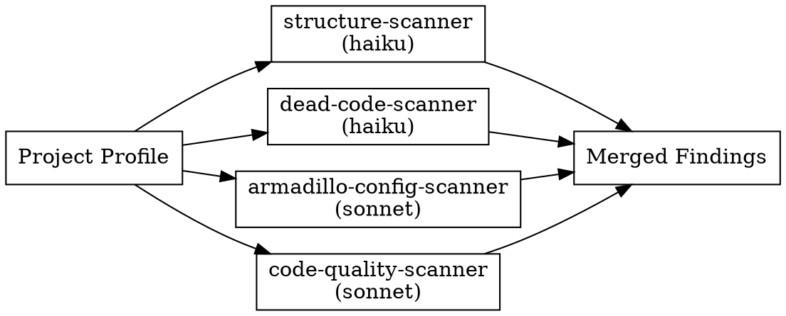

# Codebase Hygiene Skill Implementation Plan

> **For Claude:** REQUIRED SUB-SKILL: Use armadillo:executing-plans to implement this plan task-by-task.

**Goal:** Implement the `codebase-hygiene` skill — a full-repo audit and cleanup orchestrator that dispatches 4 parallel scanner agents, presents findings for approval, and fixes with safety rails.

**Architecture:** One orchestrator SKILL.md dispatches 4 background scanner agents (structure, dead-code, armadillo-config, code-quality). Scanners run in parallel via `run_in_background: true`, results merge into a unified report. User approves before any fixes are applied. Sequential fix phase with atomic commits.

**Tech Stack:** Markdown skill files, YAML frontmatter, bash hooks (sh), JSON registry (skills.json)

---

## Context

Design doc: `.claude/docs/plans/2026-02-19-codebase-hygiene-design.md`

**Files to create:**
- `skills/codebase-hygiene/SKILL.md` — orchestrator skill (opus-4-6)
- `skills/codebase-hygiene/scanner-prompts.md` — shared output format reference
- `agents/structure-scanner.md` — file/folder structure agent (haiku)
- `agents/dead-code-scanner.md` — unused code detection agent (haiku)
- `agents/armadillo-config-scanner.md` — .claude/ health check agent (sonnet)
- `agents/code-quality-scanner.md` — best practices agent (sonnet)

**Files to modify:**
- `skills.json` — register skill + agents + bundle
- `.claude/CLAUDE.md` — add Maintenance section
- `.claude/hooks/inject-skill-awareness.sh` — enforce writing-skills on skill creation
- `skills/writing-skills/SKILL.md` — correct frontmatter docs (2 fields → 3 with model)

**TDD order:** RED baseline test first, then GREEN (write files), then REFACTOR.

---

## Task 1: Write RED phase baseline test

TDD requires watching failure before writing the skill. Create a test prompt that simulates a user asking Claude to clean up a codebase, to capture what Claude does WITHOUT the skill.

**Files:**
- Create: `tests/skill-triggering/prompts/codebase-hygiene.txt`

**Step 1: Write the test prompt**

```
tests/skill-triggering/prompts/codebase-hygiene.txt contents:
```

```
This codebase is a mess. Can you do a full cleanup? Look for unused files, bad folder structure, dead code, and check if our armadillo setup is correct. Fix what you find.
```

**Step 2: Commit test file**

```bash
git add tests/skill-triggering/prompts/codebase-hygiene.txt
git commit -m "test(codebase-hygiene): add RED phase baseline prompt"
```

---

## Task 2: Run RED baseline, document failures

Run the baseline test WITHOUT the skill loaded to see what Claude does wrong by default.

**Step 1: Check if test runner exists**

```bash
ls .claude/tests/claude-code/
```

**Step 2: Document expected baseline failures**

Without the skill, Claude will likely:
- Skip git status check before modifying files
- Not dispatch parallel scanner agents
- Not use a structured findings table format
- Modify files immediately without a report → approve → fix gate
- Not invoke related skills (systematic-debugging, verification-before-completion)
- Not offer to branch off main before fixing

Record the actual failures observed so GREEN phase addresses them specifically. If you can run the test, do so. If not, proceed with the expected failures above — the skill's HARD-GATE and checklist address all of them.

---

## Task 3: Create SKILL.md (orchestrator)

**Files:**
- Create: `skills/codebase-hygiene/SKILL.md`

**Step 1: Create directory and SKILL.md**

```bash
mkdir -p .claude/skills/codebase-hygiene
```

Create `.claude/skills/codebase-hygiene/SKILL.md`:

```markdown
---
model: claude-opus-4-6
name: codebase-hygiene
description: Full repo audit and cleanup — scans structure, dead code, armadillo config, and code quality in parallel. Use when a codebase needs initial housekeeping, periodic maintenance, cleanup after inheriting a messy project, or when you want to find unused code, fix folder structure, or audit armadillo setup.
---

# Codebase Hygiene

Full-repo audit with zero surprises. Scans everything in parallel, shows you the findings, then fixes only what you approve.

**Model requirement:** Coordination, judgment calls, and fix decisions require deep reasoning. Use **Opus 4.6** (`claude-opus-4-6`).

<HARD-GATE>
Do NOT modify, delete, or create any files until you have presented the full findings report AND received explicit user approval. This applies every single run, no exceptions. "Just fix the obvious stuff" is not approval.
</HARD-GATE>

## When to Use

- Initial cleanup of a new or inherited codebase
- Periodic maintenance (monthly, quarterly, post-sprint)
- Before a major feature branch — reduce noise upfront
- After onboarding — clean up leftover setup artifacts
- Any time someone says "this codebase is a mess"

## The Process

### Phase 1: DETECT

Before scanning anything:

1. Run `git status` — if uncommitted changes exist, STOP. Warn the user: "Working tree is dirty. Commit or stash changes first, then re-run." Do not proceed.
2. Read `package.json` (if exists) — detect language, framework, test runner, package manager
3. Read `.claude/CLAUDE.md` (if exists) — detect armadillo installation
4. Glob for `src/`, `lib/`, `app/`, `pages/`, `components/` — map project structure pattern
5. Present a brief project profile before dispatching scanners

### Phase 2: SCAN (parallel)

Dispatch all 4 scanners as background agents. Pass each one the project profile from Phase 1.



Use `run_in_background: true` for all 4. Wait for all to complete before proceeding.

See `scanner-prompts.md` in this directory for the required output format.

### Phase 3: REPORT

Merge all findings. Sort by severity (◆ > ⚠ > ◇ > ℹ), group by category. Present:

```
| Finding | Severity | Category | Auto-fixable | Location |
|---------|----------|----------|--------------|----------|
```

Summary counts at top: `◆ N critical · ⚠ N warnings · ◇ N suggestions · ℹ N info`

### Phase 4: APPROVE

Default selection: all ◆ and ⚠. User opts in to ◇ and ℹ.

Ask: "Which findings should I fix? (default: all critical and warnings)"

Do NOT proceed without explicit confirmation.

### Phase 5: FIX (sequential)

Apply fixes in dependency order: structure → dead code → armadillo config → code quality.

- Fix one logical group at a time
- Commit after each group: `git commit -m "chore(hygiene): <group description>"`
- If on main/master, offer to invoke `armadillo:using-git-worktrees` first
- If a fix might have side effects, invoke `armadillo:systematic-debugging`
- After all fixes: invoke `armadillo:verification-before-completion`

### Phase 6: VERIFY

Run project's test suite and linter (detect from package.json scripts). Present completion summary.

## Safety Rules

- **Never modify files with uncommitted git changes** — check `git status` in Phase 1
- **Never delete files** — mark deletions as ◆ critical for user review; let the user confirm
- **Never fix anything without Phase 4 approval** — not even "obviously safe" fixes
- **Each fix group = one commit** — trivially easy to revert individual changes
- **Scanners are read-only** — they report findings, never write

## Common Mistakes

| Mistake | Fix |
|---------|-----|
| Skipping git status check | Phase 1 requires it. Dirty tree = stop immediately. |
| Fixing before getting approval | HARD-GATE: report first, approval second, fix third. Always. |
| Running scanners sequentially | All 4 run in parallel with `run_in_background: true`. |
| Deleting files directly | Mark as ◆ critical. User confirms. You never delete. |
| One giant commit for all fixes | Commit per logical group. Never batch unrelated changes. |
| "User said clean everything" = blanket approval | Phase 4 approval is always required. |

## Integration

**Invokes when needed:**
- **armadillo:using-git-worktrees** — branch off main before fixing
- **armadillo:systematic-debugging** — if a fix breaks something
- **armadillo:verification-before-completion** — after all fixes applied
- **armadillo:test-driven-development** — if adding missing test files
```

**Step 2: Verify file created correctly**

```bash
ls -la .claude/skills/codebase-hygiene/
head -10 .claude/skills/codebase-hygiene/SKILL.md
```

Expected: directory exists, frontmatter shows `model: claude-opus-4-6`

**Step 3: Commit**

```bash
git add .claude/skills/codebase-hygiene/SKILL.md
git commit -m "feat(codebase-hygiene): add orchestrator SKILL.md"
```

---

## Task 4: Create scanner-prompts.md

**Files:**
- Create: `skills/codebase-hygiene/scanner-prompts.md`

**Step 1: Create scanner-prompts.md**

Create `.claude/skills/codebase-hygiene/scanner-prompts.md`:

```markdown
# Scanner Output Format

Shared reference for all codebase-hygiene scanner agents. Every scanner MUST return findings in this exact format so the orchestrator can merge them.

## Findings Table

One row per finding:

| Finding | Severity | Category | Auto-fixable | Location |
|---------|----------|----------|--------------|----------|
| `src/utils/legacy.ts` has no imports anywhere | ◆ critical | Dead Code | no | `src/utils/legacy.ts` |
| `src/components/` has 47 files with no subdirectories | ◇ suggestion | Structure | yes | `src/components/` |
| Hook script `hooks/old-hook.sh` referenced in hooks.json but file missing | ⚠ warning | Armadillo Config | no | `.claude/hooks/hooks.json:12` |

## Severity Levels

| Symbol | Level | When to Use |
|--------|-------|-------------|
| `◆` | critical | Broken tooling, security risk (hardcoded secrets), or error-causing issue |
| `⚠` | warning | Real technical debt, broken reference, missing required file |
| `◇` | suggestion | Improvement that would help but isn't urgent |
| `ℹ` | info | Awareness only — not actionable, just context |

## Auto-fixable Rules

Mark `yes` only if the fix is:
- A mechanical rename/move with zero logic change
- Formatting or casing normalization
- Adding a missing but obviously empty file (e.g., `.gitkeep`)

Mark `no` if the fix requires:
- Any judgment about business logic
- Deleting files (even if clearly unused — user must confirm)
- Structural changes that could break imports

**When in doubt: mark `no`.**

## Return Format

After the findings table, return:

```
SUMMARY:
- Critical: N
- Warnings: N
- Suggestions: N
- Info: N
- Total: N
```

## Scope Constraint

**Scanners are read-only.** Use only: Read, Glob, Grep, Bash (read-only commands like `git log`, `git blame`, `ls`). Never Write, Edit, or execute mutations.

If you find a hardcoded secret or credentials, mark it `◆ critical` and prepend: `URGENT: review immediately —`

## What to Skip

- Files in `node_modules/`, `.git/`, `dist/`, `build/`, `.next/`, `coverage/`
- Lock files (`package-lock.json`, `yarn.lock`, `pnpm-lock.yaml`)
- Generated files (anything with a header like `// generated`, `// auto-generated`)
- Binary files
```

**Step 2: Commit**

```bash
git add .claude/skills/codebase-hygiene/scanner-prompts.md
git commit -m "feat(codebase-hygiene): add shared scanner output format"
```

---

## Task 5: Create structure-scanner agent

**Files:**
- Create: `agents/structure-scanner.md`

**Step 1: Create agent file**

Create `.claude/agents/structure-scanner.md`:

```markdown
---
name: structure-scanner
description: |
  Read-only file and folder structure scanner for codebase-hygiene. Audits directory organization, naming conventions, empty directories, config file placement, oversized files, and barrel index files. Returns a findings table in the scanner-prompts.md format.
model: claude-haiku-4-5-20251001
---

You are a read-only structure scanner. Your job is to scan a project's file and folder organization and report findings. You never write, edit, or delete files.

## Input

You will receive a project profile containing:
- Language and framework
- Root directory structure (top-level dirs)
- Test runner and package manager

## What to Scan

Use Glob and Grep to check these six areas:

### 1. Directory Organization
- Are source files in the right directories? (e.g., components in `components/`, utils in `utils/`)
- Is there flat sprawl? (more than 20 files in a single directory with no subdirectories)
- Deeply nested paths (more than 5 levels deep for source files)?

### 2. Naming Conventions
- Inconsistent file casing across the same directory? (some kebab-case, some camelCase, some PascalCase)
- Mismatched file names and their default exports? (e.g., `myComponent.ts` exporting `MyComponent`)
- Non-standard config file names (e.g., `Webpack.config.js` instead of `webpack.config.js`)

### 3. Empty Directories
- Directories containing only `.gitkeep` or nothing at all
- Directories named `tmp/`, `temp/`, `scratch/` that exist in the repo

### 4. Config File Placement
- Multiple config files for the same tool scattered across directories (e.g., two `.eslintrc` files)
- Config files that belong at root but are nested (e.g., `src/.env`)
- Duplicate config files with slight name variations (`webpack.config.js` + `webpack.config.old.js`)

### 5. File Size Outliers
- Any single source file over 500 lines (not counting comments/blank lines)
- Files that appear to be combining multiple unrelated concerns (check by filename and size)

### 6. Barrel/Index Files
- `index.ts`/`index.js` files that re-export from subdirectory with imports that no longer exist (stale re-exports)
- Major feature directories missing an index barrel when the pattern is used elsewhere

## Output Format

Return findings in this exact table format:

| Finding | Severity | Category | Auto-fixable | Location |
|---------|----------|----------|--------------|----------|

Then return the SUMMARY block.

See the codebase-hygiene `scanner-prompts.md` for severity rules and format details.

## What to Skip

Skip: `node_modules/`, `.git/`, `dist/`, `build/`, `.next/`, `coverage/`, lock files, generated files.

## Scope Constraint

Read-only only. Tools allowed: Read, Glob, Grep, Bash (read-only: `ls`, `git log`, `wc -l`). Never Write, Edit, or execute mutations.
```

**Step 2: Commit**

```bash
git add .claude/agents/structure-scanner.md
git commit -m "feat(codebase-hygiene): add structure-scanner agent"
```

---

## Task 6: Create dead-code-scanner agent

**Files:**
- Create: `agents/dead-code-scanner.md`

> **Parallel with Tasks 5, 7, 8** — different files, zero overlap.

**Step 1: Create agent file**

Create `.claude/agents/dead-code-scanner.md`:

```markdown
---
name: dead-code-scanner
description: |
  Read-only dead code and unused artifact scanner for codebase-hygiene. Detects unused exports, orphan files, stale imports, commented-out code blocks, aged TODOs, and unused package.json dependencies. Returns a findings table in the scanner-prompts.md format.
model: claude-haiku-4-5-20251001
---

You are a read-only dead code scanner. Your job is to find unused and stale code artifacts and report them. You never write, edit, or delete files.

## Input

You will receive a project profile containing:
- Language and framework
- Root directory structure
- Test runner and package manager

## What to Scan

Use Glob, Grep, and Read to check these six areas:

### 1. Unused Exports
- Functions, classes, types, or constants exported from a file but never imported anywhere else
- Use Grep to search for the export name across all source files
- Mark as ⚠ warning if zero internal consumers found

### 2. Orphan Files
- Source files that are never imported by any other file
- Exclude: entry points (main.ts, index.ts at root), test files, config files, scripts/
- Use Grep to search for each filename (without extension) and the full path

### 3. Stale Imports
- Import statements referencing paths that don't exist
- Use Glob to verify each imported path actually exists

### 4. Commented-Out Code Blocks
- Blocks of commented-out code (5+ consecutive comment lines that look like code, not documentation)
- Use Grep with pattern: `//.*[{};=()]` or `#.*[{};=()]` for 5+ consecutive matches
- Mark as ◇ suggestion (not ⚠ — might be intentional reference)

### 5. Aged TODOs and FIXMEs
- TODO/FIXME comments where `git blame` shows the line is older than 30 days
- Run: `git log --follow --diff-filter=A -- <file>` to find file age
- Mark aged TODOs as ◇ suggestion

### 6. Unused Dependencies
- Packages listed in `package.json` `dependencies` or `devDependencies` that are never imported
- Use Grep to search for the package name in import/require statements across all source files
- Mark as ⚠ warning (removing deps has minor risk)
- Skip: `@types/*` packages (implicit usage), peer deps, CLI tools (check `scripts` in package.json)

## Output Format

Return findings in this exact table format:

| Finding | Severity | Category | Auto-fixable | Location |
|---------|----------|----------|--------------|----------|

Then return the SUMMARY block.

See the codebase-hygiene `scanner-prompts.md` for severity rules and format details.

## What to Skip

Skip: `node_modules/`, `.git/`, `dist/`, `build/`, `.next/`, `coverage/`, lock files, generated files, test files (test files may have "unused" exports by design).

## Scope Constraint

Read-only only. Tools allowed: Read, Glob, Grep, Bash (read-only: `git log`, `git blame`, `cat package.json`). Never Write, Edit, or execute mutations.
```

**Step 2: Commit**

```bash
git add .claude/agents/dead-code-scanner.md
git commit -m "feat(codebase-hygiene): add dead-code-scanner agent"
```

---

## Task 7: Create armadillo-config-scanner agent

**Files:**
- Create: `agents/armadillo-config-scanner.md`

> **Parallel with Tasks 5, 6, 8** — different files, zero overlap.

**Step 1: Create agent file**

Create `.claude/agents/armadillo-config-scanner.md`:

```markdown
---
name: armadillo-config-scanner
description: |
  Read-only armadillo configuration health scanner for codebase-hygiene. Audits .claude/ directory for CLAUDE.md completeness, hook integrity, rule coverage, skill registration in skills.json, settings validation, and SKILL.md frontmatter health. Returns a findings table in the scanner-prompts.md format.
model: claude-sonnet-4-6
---

You are a read-only armadillo configuration scanner. Your job is to audit the `.claude/` directory for health and correctness. You never write, edit, or delete files.

## Input

You will receive a project profile indicating whether armadillo is installed (`.claude/CLAUDE.md` exists).

If `.claude/CLAUDE.md` does not exist, return a single finding:

| Finding | Severity | Category | Auto-fixable | Location |
|---------|----------|----------|--------------|----------|
| No armadillo installation found (.claude/CLAUDE.md missing) | ℹ info | Armadillo Config | no | `.claude/` |

Then SUMMARY: Total: 1, all others 0. Stop here.

## What to Scan

### 1. CLAUDE.md Completeness
Read `.claude/CLAUDE.md` and check:
- Does it have an `armadillo:start` / `armadillo:end` block?
- Are all installed skills listed in the Skills section?
- Are all rule files `@`-referenced? (coding-standards, git-workflow, output-style, pr-format)
- Is the Model Selection table present?
- Missing skill listing = ⚠ warning; missing rule @-reference = ◆ critical (rules won't load)

### 2. Hook Integrity
Read `.claude/hooks/hooks.json` and check:
- Does each script path referenced in hooks.json actually exist?
- Are shell scripts executable? (`ls -la .claude/hooks/`)
- Are there any scripts in `.claude/hooks/` NOT referenced in hooks.json (orphan scripts)?
- Missing script = ◆ critical; orphan script = ◇ suggestion

### 3. Rule Coverage
Check that these four rule files exist:
- `.claude/rules/coding-standards.md`
- `.claude/rules/git-workflow.md`
- `.claude/rules/output-style.md`
- `.claude/rules/pr-format.md`
Missing rule file = ◆ critical

### 4. Skill Registration
- Glob `.claude/skills/*/SKILL.md` to find all installed skill files
- Check that each skill directory name appears in `skills.json` (if skills.json exists at root)
- Unregistered skill = ⚠ warning (skill is installed but won't be listed in armadillo)
- Registered in skills.json but no directory = ◆ critical

### 5. Settings Validation
Read `.claude/settings.json` and check:
- Is `CLAUDE_CODE_SUBAGENT_MODEL` env var set?
- Are there any obviously permissive permissions (`"allow": ["*"]`) without a comment?
Missing subagent model = ◇ suggestion; wildcard permissions = ⚠ warning

### 6. Frontmatter Health
For each `.claude/skills/*/SKILL.md` file, read and check YAML frontmatter:
- Has `name` field? Value matches directory name?
- Has `description` field? Under 1024 chars total frontmatter?
- Has `model` field? Value is one of the valid models?
Missing/invalid frontmatter field = ⚠ warning

Valid model values: `claude-opus-4-6`, `claude-sonnet-4-6`, `claude-haiku-4-5-20251001`, `inherit`

## Output Format

Return findings in this exact table format:

| Finding | Severity | Category | Auto-fixable | Location |
|---------|----------|----------|--------------|----------|

Then return the SUMMARY block.

See the codebase-hygiene `scanner-prompts.md` for severity rules and format details.

## Scope Constraint

Read-only only. Tools allowed: Read, Glob, Grep, Bash (read-only: `ls -la`, `wc -c`). Never Write, Edit, or execute mutations.
```

**Step 2: Commit**

```bash
git add .claude/agents/armadillo-config-scanner.md
git commit -m "feat(codebase-hygiene): add armadillo-config-scanner agent"
```

---

## Task 8: Create code-quality-scanner agent

**Files:**
- Create: `agents/code-quality-scanner.md`

> **Parallel with Tasks 5, 6, 7** — different files, zero overlap.

**Step 1: Create agent file**

Create `.claude/agents/code-quality-scanner.md`:

```markdown
---
name: code-quality-scanner
description: |
  Read-only code quality and best practices scanner for codebase-hygiene. Detects DRY violations, complexity hotspots, inconsistent patterns, security smells, missing error handling, and test coverage gaps. Returns a findings table in the scanner-prompts.md format.
model: claude-sonnet-4-6
---

You are a read-only code quality scanner. Your job is to find quality and best-practice issues and report them. You never write, edit, or delete files.

## Input

You will receive a project profile containing:
- Language and framework
- Root directory structure
- Test runner

## What to Scan

Use Read, Glob, and Grep to check these six areas. Be selective — flag real problems, not style preferences.

### 1. DRY Violations
- Logic blocks of 10+ lines that appear nearly identical in 2+ files
- Use Grep to find repeated function signatures, SQL patterns, or algorithm blocks
- Mark as ⚠ warning — but only if the duplication is clearly unintentional (not intentional test fixtures or similar)

### 2. Complexity Hotspots
- Functions over 50 lines (count with `wc -l` on the function body)
- Deeply nested conditionals (4+ levels of if/else/try nesting) — use Grep for indentation patterns
- Mark 50+ line functions as ◇ suggestion; 100+ line functions as ⚠ warning

### 3. Inconsistent Patterns
- Mixed async styles in the same file (some `async/await`, some `.then().catch()`)
- Inconsistent error handling (some `try/catch`, some uncaught `.catch()`)
- Inconsistent naming across related modules (e.g., `getUserById` in one file, `fetchUser` in another doing the same thing)
- Mark as ◇ suggestion

### 4. Security Smells
- Hardcoded secrets or tokens (search for: `= "sk-`, `= "api_key_`, `= "password"`, `Bearer `, `private_key`)
- `eval()` usage outside of test files
- `innerHTML` assignment without sanitization
- SQL string concatenation (not parameterized queries)
- Mark security findings as ◆ critical

### 5. Missing Error Handling
- Promise chains without `.catch()` or `try/catch`
- `async` functions with no error handling at any level
- Empty `catch` blocks (catch that swallows errors silently)
- Use Grep: `catch\s*\([^)]*\)\s*\{\s*\}` for empty catches
- Mark as ⚠ warning

### 6. Test Coverage Gaps
- Source files in `src/`, `lib/`, `app/` with no corresponding test file
- Check: for `src/utils/foo.ts`, is there `src/utils/foo.test.ts` or `tests/utils/foo.test.ts`?
- Exclude: `index.ts` barrel files, type-only files, config files
- Mark as ◇ suggestion (not ⚠ — coverage requirements vary by project)

## Output Format

Return findings in this exact table format:

| Finding | Severity | Category | Auto-fixable | Location |
|---------|----------|----------|--------------|----------|

Then return the SUMMARY block.

See the codebase-hygiene `scanner-prompts.md` for severity rules and format details.

## What to Skip

Skip: `node_modules/`, `.git/`, `dist/`, `build/`, `.next/`, `coverage/`, lock files, generated files, `.test.ts`/`.spec.ts` files for most quality checks (tests are intentionally verbose).

## Scope Constraint

Read-only only. Tools allowed: Read, Glob, Grep, Bash (read-only: `wc -l`, `git log`). Never Write, Edit, or execute mutations.
```

**Step 2: Commit**

```bash
git add .claude/agents/code-quality-scanner.md
git commit -m "feat(codebase-hygiene): add code-quality-scanner agent"
```

---

## Task 9: Register in skills.json

**Files:**
- Modify: `skills.json`

**Step 1: Read current skills.json**

Read `skills.json` to confirm current state.

**Step 2: Add skill entry to `skills` object**

In the `"skills"` object, add after the last `"core"` bundle skill (after `"writing-prs"`):

```json
"codebase-hygiene": {
  "name": "Codebase Hygiene",
  "description": "Full repo audit and cleanup — scans structure, dead code, armadillo config, and code quality. Dispatches parallel scanners, presents findings, fixes with approval.",
  "files": [
    "skills/codebase-hygiene/SKILL.md",
    "skills/codebase-hygiene/scanner-prompts.md"
  ],
  "agents": [
    "agents/structure-scanner.md",
    "agents/dead-code-scanner.md",
    "agents/armadillo-config-scanner.md",
    "agents/code-quality-scanner.md"
  ],
  "bundle": "core"
},
```

**Step 3: Add to `bundles.core.skills` array**

In the `"bundles"` → `"core"` → `"skills"` array, add `"codebase-hygiene"` after `"writing-prs"`:

```json
"writing-prs",
"codebase-hygiene"
```

**Step 4: Validate JSON**

```bash
node -e "JSON.parse(require('fs').readFileSync('skills.json','utf8')); console.log('valid')"
```

Expected: `valid`

**Step 5: Commit**

```bash
git add skills.json
git commit -m "feat(codebase-hygiene): register in skills.json"
```

---

## Task 10: Update CLAUDE.md

**Files:**
- Modify: `.claude/CLAUDE.md`

**Step 1: Add Maintenance section**

In `.claude/CLAUDE.md`, inside the `<!-- armadillo:start -->` block, add a new `### Maintenance` section after `### Meta`:

```markdown
### Maintenance
- **codebase-hygiene** — Full repo audit: structure, dead code, config health, quality
```

Also add `codebase-hygiene` to the Model Selection table under Opus 4.6 use cases (since the orchestrator uses opus):

Find the Opus 4.6 row and append `codebase-hygiene` to the Use Cases cell.

**Step 2: Verify the block structure is intact**

```bash
grep -n "armadillo:start\|armadillo:end\|codebase-hygiene" .claude/CLAUDE.md
```

Expected: `armadillo:start` on line 1, `codebase-hygiene` appears in Maintenance section and Model table, `armadillo:end` at the end of the managed block.

**Step 3: Commit**

```bash
git add .claude/CLAUDE.md
git commit -m "feat(codebase-hygiene): add to CLAUDE.md Maintenance section"
```

---

## Task 11: Bump executing-plans and subagent-driven-development to Opus

**Files:**
- Modify: `skills/executing-plans/SKILL.md`
- Modify: `skills/subagent-driven-development/SKILL.md`

Both are plan-reading orchestrators making judgment calls — same class of work as writing-plans and dispatching-parallel-agents. Currently Sonnet, should be Opus.

**Step 1: Read executing-plans frontmatter**

```bash
head -5 .claude/skills/executing-plans/SKILL.md
```

**Step 2: Change model to opus**

In `.claude/skills/executing-plans/SKILL.md`, change:
```yaml
model: claude-sonnet-4-6
```
to:
```yaml
model: claude-opus-4-6
```

**Step 3: Read subagent-driven-development frontmatter**

```bash
head -5 .claude/skills/subagent-driven-development/SKILL.md
```

**Step 4: Change model to opus**

In `.claude/skills/subagent-driven-development/SKILL.md`, change:
```yaml
model: claude-sonnet-4-6
```
to:
```yaml
model: claude-opus-4-6
```

**Step 5: Update CLAUDE.md model tier table**

In `.claude/CLAUDE.md`, update the Opus 4.6 row to include `executing-plans, subagent-driven-development` in the Use Cases cell.

**Step 6: Commit**

```bash
git add .claude/skills/executing-plans/SKILL.md .claude/skills/subagent-driven-development/SKILL.md .claude/CLAUDE.md
git commit -m "feat: bump executing-plans and subagent-driven-development to opus tier"
```

---

## Task 12: Update writing-skills SKILL.md (frontmatter correction)

**Files:**
- Modify: `skills/writing-skills/SKILL.md`

The writing-skills doc says "Only two fields supported: name and description" but all actual skill files use three fields (`model`, `name`, `description`). Fix the docs to match reality.

**Step 1: Read the writing-skills SKILL.md**

Read `.claude/skills/writing-skills/SKILL.md` and find the frontmatter documentation section.

**Step 2: Find the incorrect line**

Look for: `Only two fields supported: name and description`

**Step 3: Update to reflect reality**

Replace the frontmatter docs section to show 3 fields:

```yaml
# Frontmatter (YAML):
# - model: required — see model tier table in CLAUDE.md
# - name: required — letters, numbers, hyphens only
# - description: required — WHAT + WHEN, never HOW. Max 1024 chars total.
```

And update the template to show:

```markdown
---
model: claude-opus-4-6
name: Skill-Name-With-Hyphens
description: Use when [specific triggering conditions and symptoms]
---
```

**Step 4: Commit**

```bash
git add .claude/skills/writing-skills/SKILL.md
git commit -m "fix(writing-skills): correct frontmatter docs to include required model field"
```

---

## Task 13: Update inject-skill-awareness.sh for enforcement

**Files:**
- Modify: `hooks/inject-skill-awareness.sh`

Armadilloers need enforcement: when they start creating a skill, the hook must surface `writing-skills` prominently. Right now the hook is a generic reminder. Add pattern detection for skill-creation context.

**Step 1: Read current hook**

```bash
cat .claude/hooks/inject-skill-awareness.sh
```

Current content just injects a generic reminder.

**Step 2: Update the hook**

Replace the content of `.claude/hooks/inject-skill-awareness.sh`:

```bash
#!/usr/bin/env bash
# UserPromptSubmit hook: injects skill awareness reminder into Claude's context.
# No matcher — fires on every user prompt.

# Check for skill-creation intent in the user's prompt
PROMPT="${claude_user_message:-}"
SKILL_CREATION_PATTERN='(new skill|create.*skill|write.*skill|SKILL\.md|add.*skill|skill.*creator|skill.*author)'

if echo "$PROMPT" | grep -qiE "$SKILL_CREATION_PATTERN"; then
  cat <<'EOF'
{
  "hookSpecificOutput": {
    "hookEventName": "UserPromptSubmit",
    "additionalContext": "SKILL CREATION DETECTED: You MUST invoke the writing-skills skill before creating or editing any SKILL.md file. Use the Skill tool: Skill('writing-skills'). The TDD cycle (RED baseline test first, then GREEN write skill, then REFACTOR) is mandatory. Skipping this is a quality violation."
  }
}
EOF
else
  cat <<'EOF'
{
  "hookSpecificOutput": {
    "hookEventName": "UserPromptSubmit",
    "additionalContext": "REMINDER: Before responding, check if an armadillo skill applies to this request. Use the Skill tool to invoke skills. Never bypass skills with Explore/Plan agents or EnterPlanMode."
  }
}
EOF
fi

exit 0
```

**Step 3: Verify shell script is valid**

```bash
bash -n .claude/hooks/inject-skill-awareness.sh && echo "syntax ok"
```

Expected: `syntax ok`

**Step 4: Commit**

```bash
git add .claude/hooks/inject-skill-awareness.sh
git commit -m "feat(hooks): enforce writing-skills on skill creation attempts"
```

---

## Task 14: GREEN phase — run tests, verify skill is triggered

**Step 1: Verify skill structure**

```bash
ls -la .claude/skills/codebase-hygiene/
ls -la .claude/agents/ | grep scanner
```

Expected:
```
skills/codebase-hygiene/SKILL.md
skills/codebase-hygiene/scanner-prompts.md
agents/structure-scanner.md
agents/dead-code-scanner.md
agents/armadillo-config-scanner.md
agents/code-quality-scanner.md
```

**Step 2: Verify skills.json registration**

```bash
node -e "
const s = JSON.parse(require('fs').readFileSync('skills.json','utf8'));
console.log('skill entry:', !!s.skills['codebase-hygiene']);
console.log('in bundle:', s.bundles.core.skills.includes('codebase-hygiene'));
console.log('agents:', s.skills['codebase-hygiene'].agents.length);
console.log('files:', s.skills['codebase-hygiene'].files.length);
"
```

Expected:
```
skill entry: true
in bundle: true
agents: 4
files: 2
```

**Step 3: Verify all agent files referenced in skills.json exist**

```bash
node -e "
const s = JSON.parse(require('fs').readFileSync('skills.json','utf8'));
const agents = s.skills['codebase-hygiene'].agents;
const files = s.skills['codebase-hygiene'].files;
const fs = require('fs');
[...agents, ...files].forEach(f => {
  const exists = fs.existsSync('.claude/' + f);
  console.log(exists ? '✓' : '✗', f);
});
"
```

Expected: all 6 lines show `✓`

**Step 4: Verify CLAUDE.md has Maintenance section**

```bash
grep -A2 "### Maintenance" .claude/CLAUDE.md
```

Expected: shows `codebase-hygiene` entry

**Step 5: Verify hook syntax**

```bash
bash -n .claude/hooks/inject-skill-awareness.sh && echo "hook: syntax ok"
```

**Step 6: Commit verification if all green**

No additional commit needed — tests confirmed correctness.

---

## Task 15: REFACTOR — add explicit test prompt for skill triggering

**Files:**
- Create: `tests/skill-triggering/prompts/codebase-hygiene.txt` (update the RED test to also serve as GREEN verification)

**Step 1: Read current test file**

The test file was created in Task 1. Read it to confirm content.

**Step 2: Add a second test prompt for explicit invocation**

Create `tests/explicit-skill-requests/prompts/codebase-hygiene.txt`:

```
Please run the codebase hygiene skill on this project. I want a full audit of structure, dead code, our .claude/ config, and code quality.
```

**Step 3: Final commit**

```bash
git add tests/explicit-skill-requests/prompts/codebase-hygiene.txt
git commit -m "test(codebase-hygiene): add explicit invocation test prompt"
```

---

## Summary

| Task | Files | Parallel? | Commit |
|------|-------|-----------|--------|
| 1: RED test prompt | `tests/skill-triggering/prompts/codebase-hygiene.txt` | — | `test: add RED baseline` |
| 2: Run baseline | — | — | — |
| 3: SKILL.md | `skills/codebase-hygiene/SKILL.md` | — | `feat: orchestrator` |
| 4: scanner-prompts.md | `skills/codebase-hygiene/scanner-prompts.md` | — | `feat: output format` |
| 5: structure-scanner | `agents/structure-scanner.md` | ✓ with 6,7,8 | `feat: structure agent` |
| 6: dead-code-scanner | `agents/dead-code-scanner.md` | ✓ with 5,7,8 | `feat: dead-code agent` |
| 7: armadillo-scanner | `agents/armadillo-config-scanner.md` | ✓ with 5,6,8 | `feat: armadillo agent` |
| 8: quality-scanner | `agents/code-quality-scanner.md` | ✓ with 5,6,7 | `feat: quality agent` |
| 9: skills.json | `skills.json` | — (after 3-8) | `feat: register skill` |
| 10: CLAUDE.md | `.claude/CLAUDE.md` | — (after 11) | `feat: Maintenance section` |
| 11: Model tier bump | `executing-plans`, `subagent-driven-development`, `CLAUDE.md` | — | `feat: bump to opus` |
| 12: writing-skills fix | `skills/writing-skills/SKILL.md` | ✓ with 11 | `fix: frontmatter docs` |
| 13: hook enforcement | `hooks/inject-skill-awareness.sh` | ✓ with 11,12 | `feat: enforce writing-skills` |
| 14: GREEN verify | — | — | — |
| 15: test prompt | `tests/explicit-skill-requests/prompts/codebase-hygiene.txt` | — | `test: explicit prompt` |

**Parallel opportunities:**
- Tasks 5, 6, 7, 8 — all 4 scanner agents, zero file overlap, dispatch simultaneously
- Tasks 12, 13 — writing-skills fix + hook enforcement, different files
