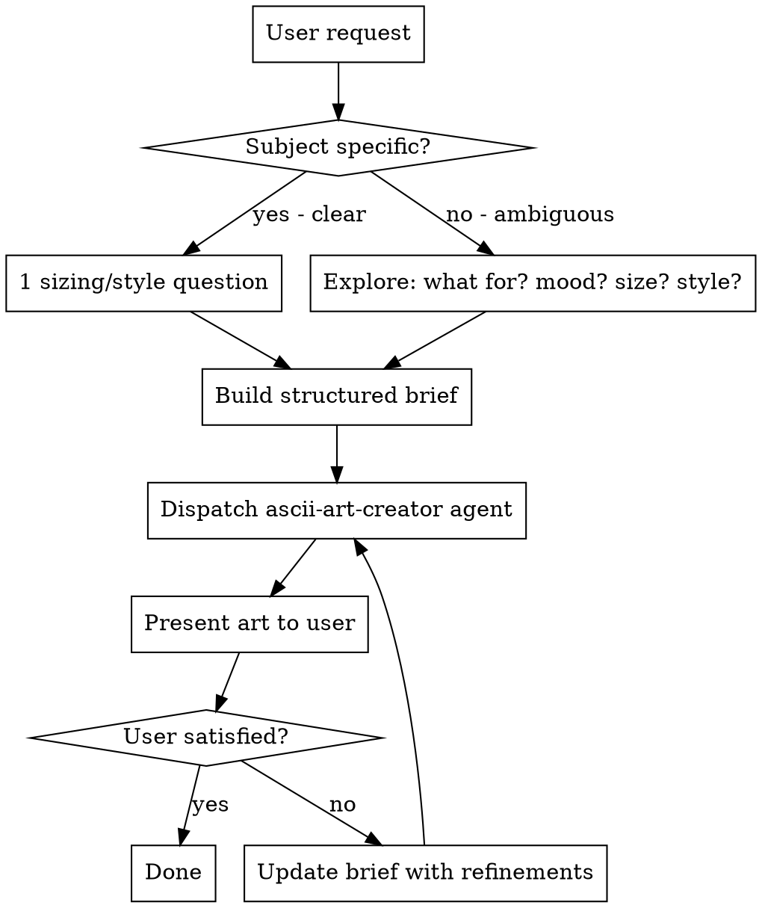

# ASCII Art

## Overview

Create high-quality ASCII art for standalone use or CLI integration. This skill handles discovery (understanding what the user wants), builds a structured brief, and dispatches to the `ascii-art-creator` agent for production.

**Core principle:** Understand before drawing. Build a brief, dispatch an agent, iterate on results.

## Adaptive Discovery Flow



### Assessing Request Clarity

**Clear request** (subject is specific, e.g. "make me an ASCII fox" or "CLI banner for my tool called Neptune"):
- Skip deep exploration
- Ask ONE quick question to nail down size and style: "Want this small and minimal, or large and detailed?"
- If CLI context is obvious from the request, note it in the brief -- no need to ask
- Build brief and dispatch

**Ambiguous request** (e.g. "make some cool ASCII art" or "I need art for my project"):
- Ask targeted questions, ONE AT A TIME:
  1. What's the subject? (What should it depict?)
  2. What's it for? (Standalone piece, CLI banner, help screen, error art?)
  3. Size preference? (Small icon, medium banner, large splash?)
  4. Style/mood? (Minimal silhouette, detailed filled, playful, serious?)
- Stop asking once you have enough to build a brief -- don't interrogate
- If user gives short answers, infer reasonable defaults and note assumptions

## Structured Brief Format

Before dispatching, assemble this brief:

```
Subject:     [what to draw]
Size:        [small / medium / large] or [specific dimensions]
Style:       [silhouette / filled / mixed / scene]
Context:     [standalone / CLI banner / help screen / error art / etc.]
Constraints: [max width, no Unicode, specific escaping, language, etc.]
Notes:       [any additional context from discovery]
```

**CLI detection:** If the user mentions a CLI tool, command-line app, terminal output, or code integration, set Context to the appropriate CLI variant and include the target language in Constraints. Don't wait for the user to ask for code-ready output -- infer it from context.

## Dispatch Instructions

Dispatch the `ascii-art-creator` agent using the Task tool. Include:

1. The structured brief (copy the filled-in template above)
2. Instruction to read `.claude/skills/ascii-art/reference.md` before starting
3. Any specific user preferences or constraints discovered

Example dispatch:

```
Create ASCII art from this brief:

Subject:     Fox mascot
Size:        medium (40-60 cols)
Style:       mixed (outline with selective shading)
Context:     CLI banner for a CLI tool
Constraints: max 60 cols, ASCII-safe only, provide JavaScript template literal

Read .claude/skills/ascii-art/reference.md for character palettes,
proportional rules, and quality checklist. Follow the planning protocol
fully before drawing.
```

## Iteration

When the user wants changes to the art:

1. **Identify what to change** -- ask the user what specifically they want different if not clear
2. **Update the brief** -- modify only the relevant fields, add refinement notes
3. **Re-dispatch** with the updated brief AND the previous art (so the agent can do targeted edits)
4. **Present the revised art** -- show what changed

**Don't start from scratch** unless:
- The user explicitly requests it
- The proportions or composition are fundamentally wrong
- The style needs a complete change

Example iteration dispatch:

```
Refine this ASCII art based on user feedback:

Original brief: [previous brief]
Previous art: [paste the art]
Refinement: "Make the eyes bigger and add more detail to the shell"

Read .claude/skills/ascii-art/reference.md. Preserve the overall
composition -- only modify the specified elements.
```

## Common Mistakes

| Mistake | Fix |
|---------|-----|
| Skipping discovery, guessing what user wants | Always ask at least one clarifying question |
| Asking too many questions | Clear requests need ONE question max. Stop when you have enough. |
| Not detecting CLI context | If user mentions a tool/app/terminal, set CLI context automatically |
| Dumping all art knowledge into the dispatch | The agent loads reference.md -- just send the brief |
| Starting from scratch on every iteration | Send previous art with refinement notes for targeted edits |
| Producing art yourself instead of dispatching | You are the orchestrator. The agent produces art. Always dispatch. |
