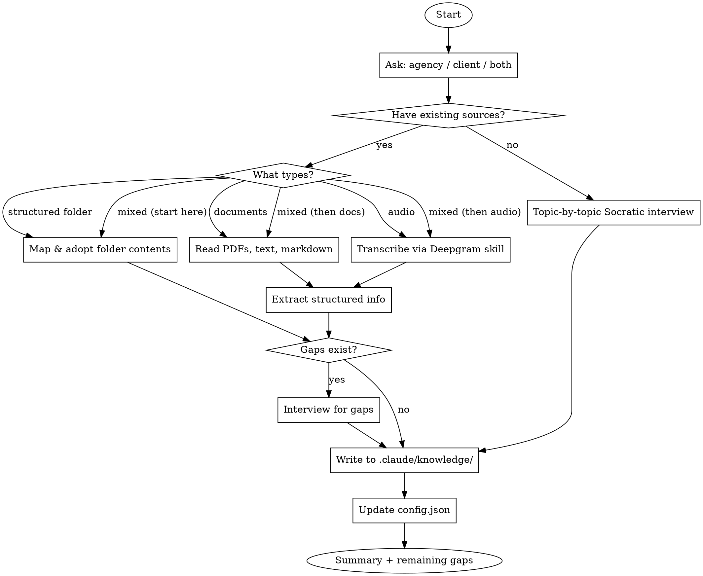

# Brand Knowledge Builder

## Overview

Builds and maintains a per-project brand knowledge base in `.claude/knowledge/`. Extracts brand information from documents, audio recordings, pre-structured folders, or Socratic interview — then writes structured markdown files the `brand-strategist` agent consumes. Also generates `brand.json` with machine-readable structured data (colors, fonts, logos, products).

**10 knowledge base sections:** brand-identity, audience-profiles, voice-and-tone, messaging-framework, competitive-landscape, content-strategy, business-model, visual-identity, brand-dictionary, product-catalog.

## When to Use

- Starting a new client project and need to capture brand knowledge
- Client provided brand documents (PDFs, text files, brand guides)
- Have audio recordings to transcribe (client interviews, discovery calls)
- Have a pre-structured folder of LLM-friendly markdown/text files to import
- Need to fill in knowledge gaps through interview
- Updating existing knowledge base with new information
- Toggling agency/client sections on or off

## Process Flow



## Step-by-Step Process

### 1. Determine Scope

Ask the user which sections to build:
- **Agency only** — brand identity, services, positioning
- **Client only** — brand identity, audience, messaging, content strategy, competitive, business model, voice/tone, visual identity, brand dictionary, product catalog
- **Both** — all of the above

### 2. Detect Input Sources

Ask the user:
> "Do you have existing sources to work from? If so, what kind?"

Options:
- **Pre-structured folder** — already-organized markdown/text files (LLM-friendly, one topic per file)
- **Documents** — PDFs, text files, brand guides, pitch decks (raw material needing extraction)
- **Audio recordings** — client interviews, discovery calls, meeting recordings
- **Mixed** — any combination of the above (e.g., structured folder + raw PDFs + audio). Run each applicable step in order: Step 3 for structured files, Step 4 for raw docs, Step 5 for audio
- **No sources** — start with interview mode

### 3. Import Pre-Structured Folder (if selected)

This is a fast-path for users who already have organized knowledge files. **Trust the user's work — adopt, don't extract.**

1. **Ask for the folder path(s)** — can be one folder or multiple (e.g., `~/brand/agency/` and `~/brand/client/`)
2. **Scan the folder** — list all `.md` and `.txt` files using Glob (recursive — `**/*.md`, `**/*.txt`)
3. **Map files to KB sections** — check the **full relative path** (parent folders + filename) against these keywords:

| Path or filename contains... | Maps to KB file |
|---|---|
| `audience`, `persona`, `icp` | `audience-profiles.md` |
| `voice`, `tone`, `writing` | `voice-and-tone.md` |
| `message`, `messaging`, `value-prop` | `messaging-framework.md` |
| `competitive`, `competitor`, `landscape`, `market` | `competitive-landscape.md` |
| `content`, `editorial`, `calendar` | `content-strategy.md` |
| `business`, `model`, `pricing`, `revenue` | `business-model.md` |
| `brand`, `identity`, `mission`, `story` | `brand-identity.md` |
| `service`, `offering`, `capability` | `services.md` (agency) |
| `position`, `differentiator` | `positioning.md` (agency) |
| `visual`, `design`, `color`, `font`, `logo`, `style-guide` | `visual-identity.md` |
| `dictionary`, `glossary`, `terminology`, `phrase`, `slogan` | `brand-dictionary.md` |
| `product`, `catalog`, `sku`, `inventory`, `lineup` | `product-catalog.md` |

   **Content-based fallback:** If a file's path doesn't match any keyword, read the first 20-30 lines and match based on content. If still ambiguous, add it to the unmapped list.

4. **Present the mapping** — show the user which of their files maps to which KB section. If multiple files map to the same section, show them grouped. Ask them to confirm or adjust before proceeding.
5. **For each mapped file (or group):**
   - If **one file** maps to a KB section: read it, adopt its content into the KB file, preserving the user's structure and wording
   - If **multiple files** map to one KB section: read all of them first, then write a single merged KB file that combines content from all sources. Use headings or separators to preserve each file's contribution
   - Only restructure if the content is truly unformatted (wall of text) — otherwise keep the user's headings and organization
   - Add `<!-- Sources: imported from path/to/file.md, path/to/other.md -->` comment listing all source files
6. **Unmapped files** — handle each individually (not as a batch). For each unmapped file, ask: "This file didn't match a KB section: [name]. Should I (a) add it as a supplementary file in `.claude/knowledge/`, (b) merge its content into [suggested closest section], or (c) skip it?"
7. **Skip extraction** — do NOT decompose pre-structured content into template fields. The user's structure is the structure.

Then proceed to Step 6 (Gap Detection).

### 4. Process Documents (if provided)

For each document:
1. Read the file using the Read tool (supports PDFs, text, markdown)
2. Extract information relevant to each knowledge base section
3. Map extracted content to the correct template fields in `.claude/knowledge/`

### 5. Process Audio (if provided)

**REQUIRED SUB-SKILL:** Use deepgram-transcription for API reference.

For each audio file:
1. Read the Deepgram skill for correct API call
2. Transcribe using Deepgram REST API with `smart_format`, `diarize`, and `paragraphs` enabled
3. Parse the transcript for brand-relevant information
4. Map extracted content to knowledge base sections

### 6. Gap Detection

After processing all sources, check each template file for empty sections:
- List which sections are fully populated
- List which sections have partial info
- List which sections are completely empty

Present the gap report to the user.

### 7. Interview for Gaps

For each section with gaps, conduct a focused interview:
- **3-6 questions per topic**
- **Multiple choice when possible** (use AskUserQuestion tool)
- **One topic at a time** — don't overwhelm
- **Save after each topic** — write the file immediately so progress isn't lost

#### Interview Question Banks

**Brand Identity:**
1. What's your brand's mission in one sentence?
2. What 3-5 core values define your brand?
3. If your brand were a person, how would you describe their personality?
4. What visual elements define your brand? (colors, fonts, imagery style)

**Audience:**
1. Describe your ideal customer in one sentence
2. What's their biggest pain point your brand solves?
3. Where do they spend time online?
4. What objections do they have before buying?

**Messaging:**
1. How do you explain what you do in 30 seconds?
2. What are your top 3 value propositions?
3. What proof points back up your claims?

**Voice & Tone:**
1. Pick 3 adjectives that describe how your brand communicates
2. What words does your brand NEVER use?
3. Show me a piece of content you love that sounds like your brand

**Competitive:**
1. Name your top 3 competitors
2. What do you do better than each of them?
3. What do they do that you don't?

**Business Model:**
1. How does your business make money?
2. What's your pricing strategy?
3. Describe a successful client engagement

**Content Strategy:**
1. What topics does your brand own?
2. Which channels matter most?
3. How often do you publish content?

**Visual Identity:**
1. What are your brand's primary colors? (provide hex codes if known)
2. Do different products or variants have their own colors?
3. What fonts does your brand use for headings vs body text?
4. Describe your logo variants — primary, secondary, icon-only, horizontal, square
5. What's the overall visual style? (modern/classic, minimal/bold, photographic/illustrated)

**Brand Dictionary:**
1. What are your brand's key slogans or catchphrases?
2. Are there specific terms or phrases unique to your brand?
3. What topics or phrases should NEVER be used in brand communications?
4. Are there legal or compliance restrictions on what can be said?
5. Are there competitor terms or phrases to never associate with the brand?

**Product Catalog:**
1. What are your main product lines?
2. What variants, flavors, or sizes exist for each product?
3. Do products have associated colors or visual identifiers?
4. What are the key SKU codes or naming conventions?

### 8. Write Knowledge Base Files

For each populated section:
1. Read the existing template from `.claude/knowledge/`
2. Fill in sections with extracted/interviewed content
3. Add source tracking: `<!-- Sources: brand-guide.pdf, interview 2026-02-16 -->`
4. Write the updated file

**CRITICAL: Additive updates only.** When updating an existing file:
- Merge new information with existing content
- Never delete existing content unless explicitly asked
- Add new sources to the Sources comment
- Note conflicts: `<!-- Note: Updated 2026-02-16 - previous [X] changed to [Y] per [source] -->`

### 8.5. Generate brand.json

After writing knowledge base files, generate `brand.json` at the **project root** with machine-readable structured data extracted from the knowledge base:

```json
{
  "name": "",
  "tagline": "",
  "colors": {
    "primary": {},
    "products": {}
  },
  "fonts": {
    "header": "",
    "subheader": "",
    "body": ""
  },
  "logos": {},
  "products": []
}
```

**Rules:**
- Only populate fields that have data from the knowledge base
- Colors use hex values as strings (e.g., `"brand-blue": "#43C7FF"`)
- Fonts use full family + weight names (e.g., `"Futura PT Extra Bold"`)
- Logos section left empty — populated later by `brand-asset-organizer` when physical files are organized
- Products array: each entry has `name`, `sku` (if known), `color` (hex), `description`
- If `brand.json` already exists, merge new data (additive, same as knowledge base files)
- Brand name and tagline come from `brand-identity.md`

### 9. Update Config

After writing files, update `.claude/knowledge/config.json`:
- Set `"enabled": true` for sections that were populated
- Leave `"enabled": false` for sections that are still empty

### 10. Summary

Present a summary:
- Which files were created/updated
- Which sections are complete vs have gaps
- Suggest next steps (e.g., "Run again with audience focus to fill remaining gaps")

## Key Rules

1. **One topic at a time** — never ask about brand identity and audience in the same message
2. **Save after each topic** — write the file immediately, don't batch
3. **Merge, don't overwrite** — additive updates always
4. **Track sources** — every file gets a Sources comment
5. **Respect the toggle** — only build sections the user asked for
6. **Use templates** — follow the section headers in the existing template files
7. **Deepgram for audio** — always use the deepgram-transcription skill for transcription, never guess at audio content

## Common Mistakes

| Mistake | Fix |
|---------|-----|
| Overwriting existing knowledge base content | Always read existing file first, merge new info |
| Asking too many questions at once | One topic, 3-6 questions, save, then next topic |
| Skipping gap detection after doc parsing | Always check what's missing after processing sources |
| Not tracking sources | Every file needs `<!-- Sources: -->` comment |
| Transcribing audio without Deepgram skill | Read the deepgram-transcription skill for correct API usage |
| Building sections user didn't ask for | Respect the scope — agency, client, or both |
| Leaving config.json with enabled:false after populating | Update config after writing files |
| "Extracting" from pre-structured files into templates | Use folder import path — adopt the user's structure, don't decompose it |
| Treating pre-structured markdown as raw documents | Ask what type of source — structured folders are NOT the same as brand guides/PDFs |
