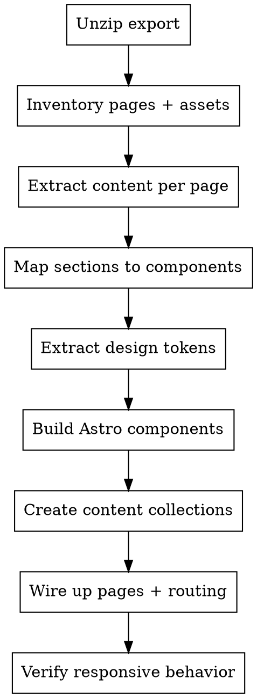

# Duda-to-Astro Migration

## Overview

Migrate exported Duda websites to Astro 5 by parsing Duda's dm-prefixed HTML structure, extracting content and styles, and rebuilding as Astro components with Content Collections. Duda exports are static HTML snapshots — NOT source code — so migration is content extraction, not code porting.

## When to Use

- Migrating any Duda website export to Astro
- Parsing Duda HTML to understand structure
- Mapping Duda widgets to Astro components
- Extracting styles from Duda CSS bundles

**Don't use for:** Building Astro sites from scratch, non-Duda migrations, Duda API integrations.

## What Duda Exports (and Doesn't)

**Exported (ZIP file):**
- Rendered HTML per page (desktop viewport)
- CSS bundles (Foundation framework + Duda runtime + site styles + mobile.css)
- JavaScript (jQuery 2.1.1 + Duda runtime engine)
- Images and fonts (local copies)
- `_dm/` internal directory with Duda runtime assets

**NOT Exported:**
| Content Type | Alternative |
|-------------|-------------|
| Blog posts | Export via RSS feed separately |
| Store/products | Export as CSV from Duda dashboard |
| Form logic | Must rebuild from scratch — forms are dead HTML |
| Dynamic pages | Only static page snapshots |
| Membership data | No export available |
| Personalization rules | No export available |

## Duda DOM Hierarchy

```
body.dmRoot
  └─ div.dmwr
      └─ div.dm_wrapper
          └─ div.dm-home-page (or dm-{pagename})
              └─ div[dm:templateid] (template section)
                  └─ div.dmOuter
                      └─ div.dmInner
                          └─ div.dmLayoutWrapper
                              └─ div.dmRespRow (section rows)
                                  └─ div.dmRespColsWrapper
                                      └─ div.dmRespCol (columns)
```

## Key Class Mapping

| Duda Class | Meaning | Astro Component |
|-----------|---------|-----------------|
| `dmRespRow` | Section/row container | `<Section>` |
| `dmRespCol` | Column within row | Grid child / `<Column>` |
| `dmRespColsWrapper` | Column wrapper | CSS Grid/Flexbox container |
| `dmNewParagraph` | Text block | Extract text → markdown or `<p>` |
| `dmButtonLink` | Button/CTA | `<a>` or `<Button>` component |
| `dmImageSlider` | Image carousel | `<ImageSlider>` component |
| `dmPhotoGallery` | Photo gallery | `<Gallery>` component |
| `dmWidget` | Generic widget wrapper | Depends on `data-widget-type` |
| `dmform` | Contact/lead form | Rebuild with form library |
| `dmNav` | Navigation | `<Navigation>` component |
| `dmFooter` | Footer | `<Footer>` component |

## CSS Architecture

Duda exports include multiple CSS layers (load order matters):

1. **Foundation framework** — ZURB Foundation grid (`small-12`, `medium-6`, `large-4`)
2. **Duda font package** — Custom font declarations
3. **Duda runtime CSS** — `_dm/s/rt/dist/css/` base styles
4. **Site CSS** — `{siteId}_1.min{hash}.css` (main site styles)
5. **Page CSS** — Page-specific overrides
6. **Mobile CSS** — `mobile.css` at `@media (max-width: 800px)`

**Critical:** Duda uses Foundation grid classes ALONGSIDE dm-prefixed classes. Both affect layout.

## Responsive Approach

Duda does NOT use standard responsive design:
- **Desktop:** Primary layout in main CSS
- **Mobile:** Completely separate `mobile.css` with `max-width: 800px` breakpoint
- **Foundation helpers:** `hide-for-small`, `show-for-medium-up`, etc.
- **No tablet breakpoint** — only desktop and mobile

**Migration strategy:** Extract the design intent, rebuild with modern CSS (Grid/Flexbox) using proper breakpoints.

## CDN References

All asset URLs reference Duda's CDN: `irp-cdn.multiscreensite.com/{siteId}/`

These MUST be rewritten to local paths or your own CDN. Download all referenced assets.

## Data Attributes (Content Extraction Hints)

| Attribute | Purpose |
|----------|---------|
| `data-widget-type` | Widget type identifier |
| `data-dmtmpl` | Template identifier |
| `data-editor-state` | Editor metadata (ignore) |
| `data-background-parallax-*` | Parallax settings |
| `dm:templateid` | Section template ID |
| `dm:templateorder` | Section ordering |
| `editablewidget` | Marks editable content areas |

## Migration Workflow



## Astro 5 Reminders

| Item | Correct (Astro 5) | Wrong (Astro 4) |
|------|-------------------|-----------------|
| Page transitions | `<ClientRouter />` from `astro:transitions` | ~~`<ViewTransitions />`~~ |
| Content config | `src/content.config.ts` with `glob()` loader | ~~`src/content/config.ts`~~ |
| Collection entry ID | `entry.id` | ~~`entry.slug`~~ |
| Render content | `const { Content } = await render(entry)` | ~~`entry.render()`~~ |
| Import render | `import { render } from 'astro:content'` | N/A |

## Common Mistakes

| Mistake | Fix |
|---------|-----|
| Trying to preserve Duda's class names | Strip all dm-prefixed classes; rebuild with semantic HTML |
| Keeping Foundation CSS | Don't carry Foundation over; use modern CSS Grid/Flexbox |
| Ignoring mobile.css | Mobile has completely different layout rules; inspect both |
| Assuming forms work | Forms are dead HTML in exports; rebuild with a form service |
| Missing CDN rewrites | Search for `irp-cdn.multiscreensite.com` and rewrite all URLs |
| Using Astro 4 content API | Use `glob()` loader in `content.config.ts`, not legacy API |
| Porting JS runtime | Duda's jQuery/runtime JS is platform glue; don't port it |

## Full Reference

See `reference.md` in this skill directory for detailed HTML parsing strategies, CSS extraction techniques, component mapping examples, and page-by-page migration procedures.
