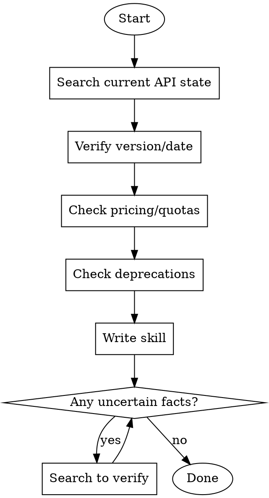

# Writing Reference Skills

## Overview

Reference skills document external tools (APIs, libraries, CLIs) where **facts change over time**. The critical difference from technique/pattern skills: training data alone produces plausible-looking but wrong information. Research is mandatory.

**Mandatory Announcement — FIRST OUTPUT before anything else:**

```
┏━ 🛡 writing-reference-skills ━━━━━━━━━━━━━━━━━━┓
┃ [one-line description of what API/tool/skill]   ┃
┗━━━━━━━━━━━━━━━━━━━━━━━━━━━━━━━━━━━━━━━━━━━━━━━━┛
```

No exceptions. Box frame first, then work.

**REQUIRED BACKGROUND:** You MUST understand writing-skills for the TDD cycle and SKILL.md structure. This skill adds the research and accuracy layer specific to reference documentation.

## When to Use

- Creating a skill for an API, SDK, CLI tool, or library
- Updating an existing reference skill with new versions/pricing/deprecations
- Any skill where facts (versions, endpoints, quotas, pricing) can become outdated

**Don't use for:** Technique skills, pattern skills, or discipline-enforcing skills -- those don't need external research.

## The Core Problem

Baseline testing revealed: agents asked to write reference skills **skip web research entirely** and rely on training data. They acknowledge uncertainty ("this version might be outdated") but don't verify. Result: plausible-looking skills with wrong API versions, outdated pricing tiers, incorrect rate limits, and missing deprecations.

**Evidence from our Google API skills:** 4 of 7 skills needed REFACTOR fixes despite the agent being "confident" in the content. Wrong pricing tier names (3 tiers vs actual 5), outdated upload quotas (1,600 vs actual ~100 units), missing service name distinctions, wrong rate limits.

## Two-File Structure

```
skill-name/
  SKILL.md       # Concise entry point (<100 lines, <500 words)
  reference.md   # Comprehensive reference (400-800 lines)
```

### SKILL.md Template (Reference Type)

```markdown
---
name: api-name
description: Use when [specific triggering conditions with API/tool name]
---

# API Name

## Overview
One sentence: what it does + current version/date.

## Quick Reference
| Item    | Value |
|---------|-------|
| Base URL | ... |
| Auth     | ... |
| Python   | `pip install ...` |
| Node.js  | `npm install ...` |

## Authentication
Minimal setup code (one language, 3-5 lines).

## Common Operations
2-3 most frequent operations with code snippets.

## Rate Limits / Quotas
Table of key limits.

## Common Mistakes
| Mistake | Fix |
|---------|-----|

## Full Reference
See `reference.md` in this skill directory for [list topics covered].
```

### reference.md Structure

- Table of contents at top
- Organized by feature area (not CRUD operations)
- Code examples in 1-2 languages max (pick the API's primary ecosystem)
- Error codes with actionable fixes
- Appendices for lookup tables (currency codes, error codes, etc.)

## Research Phase (Mandatory)



### What to Research (Checklist)

Before writing ANY reference skill, search for:

1. **Current version** -- API version number, SDK version, release date
2. **Authentication** -- Has the auth method changed? New scopes? Deprecated flows?
3. **Pricing/quotas** -- Current tier names, free thresholds, rate limits, daily caps
4. **Deprecations** -- What was removed or sunset recently? Migration deadlines?
5. **New features** -- Major additions in the last 6-12 months
6. **Breaking changes** -- Renamed endpoints, changed parameters, new requirements

### How to Research

Use WebSearch with targeted queries:
- `"[API name] API changelog 2025 2026"`
- `"[API name] pricing changes"`
- `"[API name] deprecated endpoints"`
- `"[API name] rate limits quota"`
- `"[API name] latest version"`

Use WebFetch on official docs pages for specific facts. Prioritize official documentation over blog posts.

### The "Flag and Verify" Rule

**Never write "this might be outdated" in a skill.** If you're uncertain about a fact:
1. Search for the current value
2. If you find it, use the verified value
3. If you can't find it, note the date of your best information: `(as of [date])`
4. Never leave hedging language ("probably", "I think", "might be") in the final skill

## RED-GREEN Testing for Reference Skills

Reference skills test differently from discipline skills. You're testing **accuracy**, not **compliance**.

### RED Phase (Baseline)

Ask a subagent API-specific questions WITHOUT the skill. Document:
- What facts they get wrong (versions, pricing, endpoints)
- What they're uncertain about
- What they omit entirely

### GREEN Phase (With Skill)

Same questions WITH the skill loaded. The skill should:
- Correct the wrong facts
- Fill knowledge gaps
- Provide working code examples

### What to Test (4 Questions Minimum)

1. **Authentication/setup** -- How to get started
2. **Common operation** -- Most frequent API call with code
3. **Gotcha/pricing/limits** -- The thing people get wrong
4. **Recent change** -- Something that changed in the last year

### Success Criteria

Rate each answer: does the skill provide **correct, current, actionable** information that the agent couldn't produce from training data alone? If the skill doesn't add value over baseline on at least 2 of 4 questions, it needs more research.

## Common Mistakes When Writing Reference Skills

| Mistake | Fix |
|---------|-----|
| Skipping research ("I know this API") | You know the API as of your training cutoff. Search for changes. |
| SKILL.md too long (>100 lines) | Move details to reference.md. SKILL.md is the index card. |
| reference.md too short (<300 lines) | Not enough detail. Cover auth, operations, errors, limits, examples. |
| Wrong pricing/quota numbers | Always verify with a web search. These change frequently. |
| Hedging language ("probably", "might be") | Search and verify, or note the date of your information. |
| Examples in 3+ languages | Pick 1-2 max. Match the API's primary ecosystem. |
| No error codes section | Developers search for error codes. Include the common ones with fixes. |
| Organized by CRUD instead of features | Developers think "I want to send an SMS" not "I want to create a resource." |
